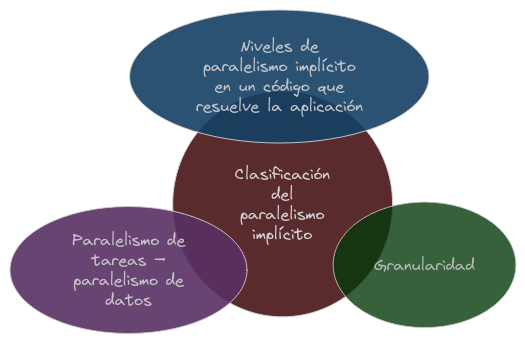
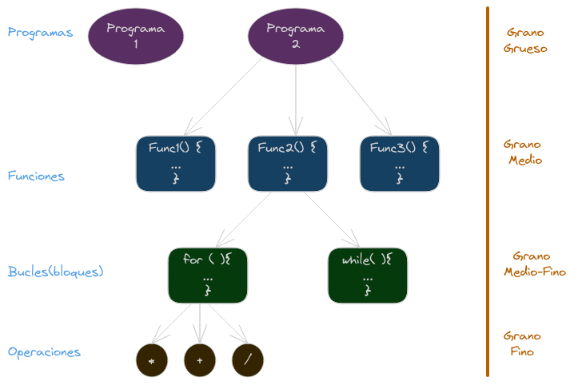
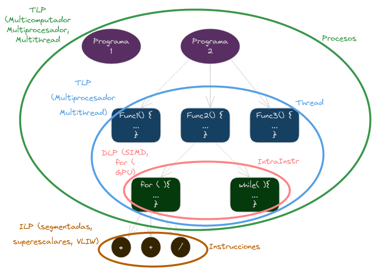

# Arquitecturas Paralelas: Clasificación y Prestaciones

## Niveles de paralelismo

{width=50%}

La programación paralela se refiere a la ejecución simultánea de múltiples tareas o procesos para resolver un problema computacional. En lugar de ejecutar un solo conjunto de instrucciones de manera secuencial, la programación paralela divide el trabajo en partes más pequeñas que pueden ejecutarse al mismo tiempo. Este enfoque tiene como objetivo mejorar el rendimiento y la eficiencia de los programas al aprovechar al máximo los recursos disponibles.

### Granuralidad del paralelismo

La **granularidad** en el contexto de la programación paralela se refiere al tamaño de las unidades de trabajo que se dividen para ejecutarse de manera simultánea. Puede considerarse como la medida de la cantidad de trabajo que se realiza en paralelo. Hay dos términos relacionados con la granularidad:

1. **Granularidad Fina (Fine-Grained):** En este enfoque, las unidades de trabajo son pequeñas y se dividen en tareas muy pequeñas. Cada tarea individual puede ser ejecutada de manera independiente. Este tipo de granularidad es útil en situaciones donde se pueden identificar y ejecutar tareas pequeñas de manera eficiente. Sin embargo, puede haber un costo asociado con la gestión del paralelismo, ya que la sobrecarga de coordinar tareas pequeñas puede superar los beneficios.

2. **Granularidad Gruesa (Coarse-Grained):** Aquí, las unidades de trabajo son más grandes y se dividen en tareas más sustanciales. Cada tarea puede requerir una mayor cantidad de cómputo antes de completarse, pero la sobrecarga de coordinación es menor en comparación con la granularidad fina. Este enfoque es útil cuando se desea minimizar la sobrecarga de administración y la comunicación entre tareas paralelas.

{width=50%}

La elección entre granularidad fina y gruesa depende del problema específico, la arquitectura del sistema y otros factores. En algunos casos, una combinación de ambos enfoques, conocida como "granularidad media", puede ser utilizada para aprovechar las ventajas de ambas opciones.

### Dependencias de datos

Esto se refiere a la relación entre las tareas paralelas y los datos que utilizan. Las dependencias de datos pueden afectar la forma en que las tareas se pueden dividir y ejecutar demanera simultánea. Hay cuatro tipos principales de dependencias de datos:
- **RAW (Read After Write):** Una tarea lee datos que han sido escritos por otra tarea. Ocurre cuando una instrucción depende del resultado de una instrucción previa que es una escritura en la memoria.
- **WAR (Write After Read):** Una tarea escribe datos que han sido leídos por otra tarea. Ocurre cuando una instrucción escribe en la memoria y otra instrucción depende del valor escrito.
- **WAW (Write After Write):** Dos tareas intentan escribir en la misma ubicación de memoria. 

Ejemplos de dependencias de datos
```c
a = b + c;
// Código que no depende de 'a'
d = a + e;
```
En este ejmplo, podemos ver una dependencia RAW entre la primera y segunda instrucción, ya que la segunda instrucción depende del resultado de la primera. Si estas instrucciones se ejecutan en paralelo, el resultado puede ser incorrecto si no se toman medidas para manejar la dependencia.

```c
a = b + c;
// Se lee 'a'
a = a + d;
// Se lee a
```
En este caso, hay una dependencia WAW entre las dos instrucciones que escriben en 'a'. Si estas instrucciones se ejecutan en paralelo, el resultado puede ser incorrecto.

```c
b = a + 1;
a = d + e;
// Se lee 'a'
```
En este ultimo caso, hay una dependencia WAR entre las dos instrucciones. La segunda instrucción depende del valor de 'a' que se lee en la primera instrucción. Si estas instrucciones se ejecutan en paralelo, el resultado puede ser incorrecto.

### Paralelismo de tareas (TLP -Task Level Par).

Se encuentra extrayendo la estructura lógica de funciones de una aplicación. Está relacionado con el paralelismo a nivel de __función__.

El paralelismo a nivel de tareas es un enfoque de programación paralela en el cual un programa se divide en tareas independientes que pueden ejecutarse simultáneamente en diferentes procesadores o núcleos de un sistema. Cada tarea es una unidad de trabajo independiente que realiza una parte específica del trabajo total. Este tipo de paralelismo se centra en la descomposición del programa en tareas más grandes y significativas en lugar de operaciones de datos individuales.

Aquí hay algunas características clave del paralelismo a nivel de tareas:

1. **Descomposición en Tareas Independientes:** El programa se divide en tareas independientes que pueden ejecutarse en paralelo. Estas tareas pueden ser funciones, subprogramas, o incluso procesos completos (aunque como se ha comentado, se relaciona especialmente con el paralelismo a nivel de funciones).

2. **Minimización de la Comunicación:** A diferencia del paralelismo a nivel de datos (que veremos a continuación), donde la comunicación entre procesos es esencial, el paralelismo a nivel de tareas tiende a minimizar la comunicación entre las tareas. Las tareas son independientes en gran medida, lo que reduce la necesidad de compartir datos constantemente.

3. **Ejecución Concurrente:** Las tareas se ejecutan simultáneamente en diferentes procesadores o núcleos. Esto puede mejorar significativamente el rendimiento al aprovechar los recursos de hardware disponibles.

4. **Coordinación Limitada:** Si bien las tareas pueden interactuar entre sí, la coordinación entre tareas es generalmente menos compleja que en otros enfoques paralelos. Esto facilita la implementación y mantenimiento del código paralelo.

5. **Ejemplos de Uso:** El paralelismo a nivel de tareas es útil en situaciones donde el programa se puede dividir en subtareas que son independientes en gran medida. Algunos ejemplos incluyen simulaciones, procesamiento por lotes, y ciertos tipos de análisis y cómputo científico.

Ejemplo en pseudocódigo:

```python
def tarea_1():
    # código de la tarea 1

def tarea_2():
    # código de la tarea 2

# Ejecutar tareas en paralelo
paralelo(tarea_1, tarea_2)
```

Donde `paralelo()` indica que las tareas pueden ejecutarse simultáneamente.

### Paralelismo de datos (DLP - Data Level Par).

El paralelismo a nivel de datos es otro enfoque de programación paralela en el cual múltiples unidades de procesamiento (como núcleos de CPU) ejecutan simultáneamente la misma operación en diferentes conjuntos de datos. El objetivo principal es realizar operaciones en paralelo sobre elementos de datos independientes, dividiendo así el trabajo y acelerando la ejecución del programa.

Algunas características clave del paralelismo a nivel de datos son:

1. **Descomposición de Datos:** En lugar de dividir el programa en tareas independientes, el paralelismo a nivel de datos se centra en descomponer los datos en conjuntos más pequeños. Cada unidad de procesamiento realiza la misma operación en su conjunto de datos.

2. **Operaciones Repetitivas:** Este enfoque es particularmente útil cuando se tienen operaciones repetitivas o bucles que realizan la misma tarea en diferentes datos. Cada iteración del bucle puede ejecutarse en paralelo en un conjunto de datos separado.

3. **Coordinación Necesaria:** Aunque las operaciones se realizan en paralelo, puede ser necesario coordinar el acceso a los datos compartidos. Esto implica gestionar la sincronización y la comunicación entre las unidades de procesamiento para evitar problemas como las condiciones de carrera.

4. **Ejemplos de Uso:** El paralelismo a nivel de datos es eficaz en tareas que implican grandes cantidades de datos que pueden procesarse simultáneamente. Se utiliza comúnmente en aplicaciones multimedia, procesamiento de imágenes, procesamiento de señales, simulaciones numéricas y otras tareas donde se realizan operaciones similares en conjuntos de datos extensos.

Ejemplo en pseudocódigo para un bucle paralelo:

```python
# Operación a realizar en paralelo sobre un conjunto de datos
def operacion(elemento):
    # código de la operación

# Datos a procesar en paralelo
datos = [1, 2, 3, 4, 5, 6, 7, 8]

# Bucle paralelo para realizar la operación en cada elemento
paralelo_para elemento en datos:
    operacion(elemento)
```

El paralelismo a nivel de datos permite aprovechar la capacidad de procesamiento de sistemas con múltiples núcleos o unidades de procesamiento, mejorando así la eficiencia y el rendimiento del programa.

### Nivel de paralelismo implícito.

El nivel de paralelismo implícito se refiere a la capacidad de un sistema para ejecutar tareas en paralelo sin la intervención explícita del programador. En otras palabras, el sistema es capaz de identificar y ejecutar tareas en paralelo de manera automática, sin requerir que el programador especifique cómo se deben dividir y ejecutar las tareas.

{width=50%}

### Nivel de paralelismo explícito.

Por otro lado el nivel de paralelismo explícito se refiere a la programación paralela en la que el programador especifica explícitamente cómo se deben dividir y ejecutar las tareas en paralelo. Esto puede implicar el uso de bibliotecas de programación paralela, extensiones de lenguaje, directivas de compilador, o modelos de programación paralela específicos.

> **Importante:**
>
> **Unidad de Control:**
> - Se refiere a la parte del procesador que gestiona la ejecución de las instrucciones. La unidad de control controla la secuencia de operaciones y garantiza que las instrucciones se ejecuten correctamente.
>
> **Thread (Hilo) o Light Process (Proceso Ligero):**
> - Es la menor unidad de ejecución gestionada por el sistema operativo. Un hilo es una secuencia de instrucciones que se pueden ejecutar en paralelo o concurrentemente. Múltiples hilos pueden ejecutarse simultáneamente en un procesador con múltiples núcleos.
>
> **Proceso:**
> - Es la mayor unidad de ejecución gestionada por el sistema operativo. Un proceso puede constar de uno o varios hilos. Cada proceso tiene su propio espacio de memoria y recursos, lo que lo hace independiente de otros procesos. Los procesos pueden ejecutarse en paralelo, y los hilos dentro de un proceso pueden coordinarse para realizar tareas de manera concurrente.

#### Proceso y Threads en un Sistema Operativo

##### Proceso

Un proceso en un sistema operativo comprende el código del programa y todos los recursos necesarios para su ejecución. Estos recursos incluyen:

- Datos en la pila.
- Segmentos para variables globales y estáticas.
- Datos en el heap.
- Contenido de los registros.
- Tabla de páginas.
- Tabla de ficheros abiertos.

Un proceso puede constar de múltiples flujos de instrucciones, conocidos como **threads** o **procesos ligeros**.

##### Threads

Cada thread dentro de un proceso tiene:

- Su propia pila.
- Contenido de los registros, incluyendo el contador de programa (instruction pointer) y el puntero de pila (stack pointer).

Para comunicar threads dentro de un mismo proceso, se utiliza la memoria compartida, permitiéndoles compartir datos de manera eficiente.

##### Comunicación entre Procesos

Para comunicar procesos, es necesario utilizar mecanismos más elaborados, ya que cada proceso tiene su propio espacio de memoria y no comparten recursos de manera directa. Se pueden utilizar técnicas como la comunicación a través de sockets, pipes o la implementación de semáforos y mutexes para garantizar la sincronización y evitar conflictos en el acceso a recursos compartidos.

