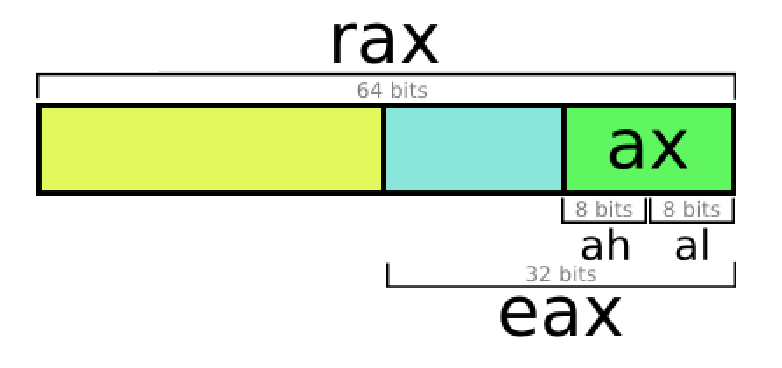

# 1. Tipos de datos

Tamaño de objetos en C (en Bytes):

|Tipo de Datos C     | Normal 32-bit    | Intes IA32    | x86-64    |
|---------------- | --------------- | --------------- | --------------- |
| `unsigned`    | 4    | 4    | 4    |
| `int`    | 4   | 4   | 4   |
| `long int`   | 4   | 4   | 4   |
| `char`  | 1  | 1 | 1 | 1 |
| `short`  | 2   | 2   | 2   |
|  `float` | 4   | 4   | 4 |
| `double`  | 8   | 8   | 8   |
| `long double`  | 8   | 10/12   | 16   |
| `char *`  | 4   | 4   | 4  |

La tabla anterior muestra la represencatción en _x86-64_ de los distintos tiposdatos de C. 

Un detalle importante del ensamblador es el concepto de `word`, que se refiere a un tipo de dato de 16 bits. En base a esto, nos referiremos a los datos de 32bits como `double words` y a los de 64 bits como `quad words`.

Cada ordenadro trabajará con unos datos de un determinado tamaño. A día de hoy cualquier ordenador moderno usará datos de 64 bits pero hasta hace no demasiadotiempo utilizaban 32 bits. Esto implica que las ordenes en ensamblador cambiarán ligeramente, ya que necesitamos especificar cual es el tamaño del tipo de dato con el que estamos trabajando. Eso se usando la ultima letra de cada instrucción para tal fin:

| Tipo de dato   | Sufijo    |
|--------------- | --------------- |
| `Byte`   | `b`   |
| `Word`   | `w`   |
| `Double Word`   | `l`   |
| `Quad word`   | `q`   |
| `Single precision`   | `s`   |
| `Double precision`   | `l`   |

`Single precision`(4 bytes) y `Double Precision`(8 bytes) hacen referencia a los tipos de datos `float` y `double` de C respectivamente. 

En la práctica, usaremos normalmente las `double words` y las `quad words`.

De esta forma, si tenemos el siguiene código:

```assembly
multstore:
    pushq
    %rbx
    movq
    %rdx, %rbx
    call
    mult2
    movq
    %rax, (%rbx)
    popq
    %rbx
    ret
```
Sabemos que estamos trabajando con de 64 bits ya que las ordenes ccuentan con el sufijo `q`.  

# 2. Acceso a información

Un procesador con arquitectura x86-64 cuenta con 16 registros de proposito general. Algunos de ellos tienen por nombre `%r` y un número, pero otros, como `%ax` tienen un determinado nombre de acuredo al uso que historicamente se le ha dado, por ejemplo, el registro `%rsp` se ha usado tradicionalmente para el puntero de pila.


Las instrucciones pueden operar en datos de diferentes tamaños almacenados en los bytes de menor orden de los 16 registros. Las operaciones a nivel de byte pueden acceder al byte menos significativo, las operaciones de 16 bits pueden acceder a los 2 bytes menos significativos, las operaciones de 32 bits pueden acceder a los 4 bytes menos significativos, y las operaciones de 64 bits pueden acceder a registros enteros.



Mas adelante, presentaremos varias instrucciones para copiar y generar valores de 1, 2, 4 y 8 bytes. Cuando estas instrucciones tienen registros como destinos, surgen dos convenciones sobre lo que sucede con los bytes restantes en el registro para las instrucciones que generan menos de 8 bytes: aquellas que generan cantidades de 1 o 2 bytes dejan los bytes restantes sin cambios. Aquellas que generan cantidades de 4 bytes establecen los 4 bytes superiores del registro en cero. Esta última convención fue adoptada como parte de la expansión de IA32 a x86-64.

## 2.1. Modos de direccionamiento.

Los modos de direccionamiento, se refieren a las diversas maneras en que se especifica la ubicación de los operandos para una instrucción. Estos modos determinan cómo el procesador accede a los datos necesarios para ejecutar una instrucción. Cada modo de direccionamiento proporciona flexibilidad y eficiencia en la manipulación de datos en memoria.

En ensamblador, los modos de direccionamiento pueden clasificarse en varias categorías, y cada categoría define la forma en que se accede a los operandos:

- Registro Directo: La instrucción opera directamente en el contenido de un registro de la CPU.

- Inmediato: La instrucción utiliza un valor constante que se proporciona directamente en la instrucción.

- Indirecto: La instrucción accede a la memoria utilizando la dirección almacenada en un registro, permitiendo operaciones con datos almacenados en la memoria.

- Indirecto con Desplazamiento: Similar al modo indirecto, pero con un desplazamiento constante añadido a la dirección almacenada en un registro.

- Indirecto con Índice y Escala: Permite acceder a elementos de arreglos mediante un índice multiplicado por una escala, sumado a la dirección almacenada en un registro.

- Registro-Indirecto con Desplazamiento: Combina un registro con un desplazamiento constante para acceder a la memoria.

- Registro-Indirecto con Índice y Escala: Similar al anterior, pero utilizando un índice multiplicado por una escala.

- Basado en Pila (Stack): Operaciones directamente relacionadas con la pila de la CPU, como empujar y sacar valores de la pila.

- Relativo a Etiqueta: Se utiliza para realizar saltos condicionales o incondicionales a ubicaciones específicas del código, basándose en la posición relativa a una etiqueta.

| Modo de Direccionamiento | Ejemplo                  | Descripción                                  |
|--------------------------|--------------------------|----------------------------------------------|
| Registro Directo         | `mov eax, ebx`           | Transfiere el contenido de un registro a otro.|
| Inmediato                | `mov ecx, 10`            | Carga un valor constante en un registro.      |
| Indirecto               | `mov edx, [eax]`         | Mueve el contenido de la memoria apuntada por un registro a otro registro.|
| Indirecto con Desplazamiento | `mov ebx, [eax+8]`  | Similar al anterior, pero con un desplazamiento constante añadido.|
| Indirecto con Índice y Escala | `mov ecx, [eax + ebx*2]`| Permite acceder a un elemento de un arreglo mediante un índice y una escala.|
| Registro-Indirecto con Desplazamiento | `mov edx, [ebx + 16]` | Combina un registro y un desplazamiento para acceder a la memoria.|
| Registro-Indirecto con Índice y Escala | `mov esi, [ebx + ecx*4]` | Similar al anterior, pero con un índice y una escala.|
| Basado en Pila (Stack)   | `push eax`               | Opera directamente con la pila.               |
| Relativo a Etiqueta      | `jmp etiqueta`           | Salta a una etiqueta específica en el código. |

La forma mas fácil de asimilar esto, es aprendiendo el caso mas general: 

$$
\text{disp(base,index,scale)} = M[disp + R[base] + R[index] \cdot scale]
$$

Algunos ejemplos con código:

```assembly
.section .text
_start: .global _start

    mov $0, %eax # inm - registro
    xor %ebx, %ebx # reg - registro
    inc %ebx # reg
    mov $array, %ecx # inmediato - reg
    mov array, %edx # directo - reg

    mov (%ecx) , %edx # indirecto
    add (%ecx,%ebx,4), %edx # combinado
    add array( ,%ebx,4), %edx # indexado
    mov -8(%ebp) 
```

{{ < embed-pdf url="./file/file.pdf"  > }}
