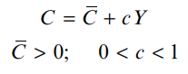

# Tema 2: El sector real en una economía cerrada.

## 2.1. Modelo Keynesiano simple.

El modelo simple de demanda agregada (Modelo Keynesiano Simple) explica el comportamiento de la producción nacional en el corto plazo.

**Laves del Modelo:**

- Interdependencia entre la producción y el gasto: El gasto determina la producción y la renta, y la renta determina el gasto.
- A corto plazo, predomina el gasto (o demanda agregada) sobre la producción (renta u oferta agregada).
- La demanda agregada (DA) es la cantidad total que están dispuestos a gastar los diferentes sectores de la economía durante un período de tiempo.
- La oferta es totalmente elástica al nivel de precios vigente.

La demanda agregada (DA), prescindiendo del sector exterior, se compone de los bienes (y servicios) demandados para el consumo (C) y para la inversión (I) por el sector privado y por el gobierno (G). Se alcanza el equilibrio, en términos macroeconómicos, cuando la producción total (Y) u oferta agregada (OA) es igual a la suma de todas las demandas (DA):

$$
Y=DA=C+I+G
$$

La inversión actúa como una variable autónoma en el modelo, y no depende del nivel de renta.

La **demanda** de consumo es el componente cuantitativamente más importante de la demanda agregada. 

La función de consumo describe la relación existente entre el consumo y el ingreso, y se puede expresar de la forma siguiente:

La variable \\(\bar{C}\\) representa el consumo que es independiente de la renta, o
consumo autónomo, y \\(c\\) es la propensión marginal al consumo, e indica la
proporción de cada unidad adicional de renta que se destina al consumo.

Como lo que no se consume se ahorra, la propension margial a la ahorro será \\(s = (1-c)\\). 

Se puede obtener ahora la demanda agregada, sin sector exterior y sin sector público:

Donde \\(Y_{0}\\) es la situación de equilibrio ya que es el nivel de producción donde \\(DA=Y\\).

Puede verse que el nivel de producción de equilibrio es mayor cuanto más elevados sean los componentes autónomos de la demanda (\\(\bar{A}\\)).

<aside>
 El valor \\(\frac{1}{(1-c)}\\) se denomina multiplicador, y es la cuantía en que se modifica la producción de equilibrio cuando alguno de los componentes autónomos de la demanda se incrementa en una unidad.

</aside>

En \\(Y_{0}\\) las empresas no tienen existencias indeseadas o insuficiencia de las
mismas, por lo que **la inversión planeada es igual al ahorro.**

El enfoque keynesiano de la política macroeconómica se asocia con la utilización activa de la **intervención del Estado para suavizar los ciclos económicos**:

- El Estado, con sus compras de bienes y servicios (`G`), puede influir significativamente en la producción y en el empleo a corto plazo.
- El sector público, por medio de transferencias (`TR`), puede incrementar la renta disponible (`YD`) y estimular el consumo y la producción.
- Las variaciones de los impuestos (`TA`) y de las transferencias afectan a la relación entre la producción y la renta disponible para el consumo y el ahorro, e influyen en la producción.

Al incorporar el sector público, la demanda agregada es ahora la suma del consumo, la inversión y el gasto público. Asimismo, el destino de la producción o renta es el consumo, el ahorro y los impuestos netos de transferencias:

El consumo ya no depende de la renta, sino de la renta disponible \\(YD\\), que es la renta de que disponen las familias después de pagar impuestos al sector público y de recibir transferencias del mismo:

Por lo que ahora el consumo depende de la renta disponible:

La política fiscal es la que sigue el sector público con respecto al nivel de sus compras, al nivel de transferencias y a la estructura impositiva, y en este modelo simple se supone que:

- Gasto público: \\(`G`\\)
- Transferencias: \\(`T`\\)
- Los impuestos son proporcionales a la renta: \\(`tY`\\)

Por tanto, la renta de equilibrio con sector público quedaría:

La intervención del Estado eleva el gasto autónomo en la cuantía de las compras gubernamentales, `G`, y del gasto inducido por las transferencias, `cT—R`.

Además, al existir un impuesto proporcional sobre la renta desciende el multiplicador.

Precisamente, el impuesto proporcional sobre la renta es un ejemplo del concepto de estabilizador automático.

<aside>
 Un **estabilizador automático** es cualquier mecanismo de la economía que reduce automáticamente —sin la intervención del Estado caso por caso— la cantidad en que varía la producción cuando varía cualquier componente de la demanda autónoma.

</aside>

Los efectos de la política fiscal en términos de variaciones de la demanda agregada se pueden expresar de la forma siguiente

> “El gobierno puede estabilizar la economía haciendo lo contrario que el resto de agentes económicos”
> 

Veamos esto mas detenidamente:

**INCREMENTO DEL GASTO**

<aside>
 Un incremento del gasto de un euro provocará un aumento de la renta superior a esa cantidad (c=0,8; t=0,25; \\(\alpha\\)= 2,5) \\(\uparrow\\) Yo = 2,5

</aside>

**INCREMENTO EN LAS TRANSFERENCIAS**

<aside>
 Un incremento de las transferencias de un euro provocará un aumento de la renta superior a esa cantidad, pero inferior al incremento del gasto público de la misma cuantía (c=0,8; t=0,25; \\(\alpha\\)= 2,5) \\(\uparrow\\)Yo = 2

</aside>

**DISMINUCIÓN DEL TIPO IMPOSITIVO**

Para calcular la variación de la renta de equilibrio se iguala la variación de la renta a la variación de la demanda agregada, y esta última tiene dos componentes. El primero es la variación experimentada por la demanda agregada ante la reducción impositiva, antes de que varíe la renta. El segundo componente de la variación de la demanda agregada es el gasto inducido por el incremento de la renta. Este componente se calcula ahora con el nuevo tipo impositivo.

## 2.2. El presupuesto.

El manejo activo de la política fiscal ha conducido a muchos gobiernos a amplios **déficits presupuestarios**, que no han sido corregidos con superávits importantes en las fases de auge de la economía. **El superávit presupuestario es la diferencia, en un ejercicio fiscal, entre los ingresos e impuestos del gobierno y la totalidad de sus gastos**, que consisten en las compras de bienes y servicios y pagos de transferencias:

<aside>
 El déficit presupuestario no sólo dependerá de las decisiones de política fiscal de los gobiernos, en cuanto a la tasa impositiva (`t`), las compras de bienes y servicios (`G`), y el volumen de transferencias (`TR`), sino también del nivel de producción (`Y`) que se alcance en el período.

</aside>

Las decisiones de política fiscal afectan al presupuesto. Al observar la fórmula del superávit presupuestario es fácil intuir que **un incremento del gasto público o un aumento del volumen de transferencias debe reducir el superávit presupuestario** (o ampliar el déficit).

Pero también es cierto que el aumento de las compras gubernamentales, o de las transferencias, aumenta la demanda agregada y la producción de equilibrio y, por tanto, también se eleva la recaudación impositiva.

<aside>
 Es fácil demostrar que, por ejemplo, un incremento del gasto, que es más expansivo que un incremento de las transferencias de la misma cuantía, no mejora el superávit presupuestario, sino que lo empeora.

Al incrementar el gasto público se reduce el superávit presupuestario. También se puede demostrar que un aumento de la tasa impositiva aumenta el superávit presupuestario, a pesar de que la subida de impuestos aminora la renta de equilibrio.

</aside>

Un resultado interesante respecto a las variaciones del gasto público y de los impuestos es el que se conoce como **multiplicador del presupuesto equilibrado**, y se refiere a los efectos que produce en la renta de equilibrio un incremento de las compras del sector público, acompañado de un incremento de los impuestos, de tal forma que en el nuevo equilibrio el superávit presupuestario es exactamente el mismo que en el equilibrio original.

Para que se cumpla que el presupuesto esté equilibrado:

Luego:

El déficit o superávit presupuestario tiene un grave defecto como indicador de la dirección de la política fiscal, ya que los movimientos del gasto privado autónomo (consumo e inversión) pueden significar cambios importantes en la producción y, por tanto, en el saldo presupuestario. Una medida de la dirección de la política fiscal, que es independiente de la situación particular del ciclo económico que tenga un país, es el superávit presupuestario de pleno empleo, que mide el **superávit presupuestario** que habría si la producción estuviera en su nivel potencial o de pleno empleo.
Este concepto también recibe otras denominaciones, como **superávit (o déficit) estructural**, **ajustado cíclicamente, de alto empleo u homogeneizado**. Por tanto, el presupuesto estructural o de pleno empleo s**e calcula a partir de los ingresos y los gastos del Estado si la economía funcionara en el nivel de producción potencial o de pleno empleo**. Se trata de un saldo presupuestario público ajustado en función del ciclo, suponiendo que el PIB real fuera exactamente el PIB potencial. El déficit así calculado fluctúa menos que el déficit real, porque años de grandes déficit presupuestarios también suelen ser años en los que la economía sufre graves períodos de recesión.

## 2.3. Curva IS.

Los niveles de inversión deseados serán menores cuanto mayor sea el tipo de interés, ya que generalmente las empresas piden préstamos para invertir. De esta forma, la función de inversión del sector privado sigue la expresión:

$$
I=\bar{I}-bi; b>0
$$

donde \\(`i`\\) es el tipo de interés y \\(`b`\\) mide la sensibilidad del gasto en inversión al tipo de interés. El nivel de inversión que es independiente de la producción o renta y del tipo de interés es \\(`\bar{I}`\\). La función de demanda agregada que hasta ahora se ha utilizado se modifica por la influencia del tipo de interés en la inversión deseada o planeada:

$$
DA=\bar{A}+c(1-t)Y-bi
$$

En esta ecuación se observa que dado cualquier nivel de producción o renta, Y, un aumento del tipo de interés reduce la demanda agregada como consecuencia de que se reduce el gasto de inversión.

<aside>
 La curva IS representa el equilibrio del mercado de bienes**. Recoge las distintas combinaciones de tipos de interés y niveles de producción en las que el mercado de bienes está en equilibrio y, por tanto, las empresas han conseguido invertir la cantidad que deseaban (no tienen existencias indeseadas).

</aside>

Tiene pendiente negativa porque, a medida que baja el tipo de interés  (representado en el eje de ordenadas), aumenta la demanda agregada y, por tanto, la producción de equilibrio (representada en el eje de abscisas). La curva IS se puede obtener a partir de la condición de equilibrio del mercado de bienes, igualando el gasto planeado o demanda agregada con la producción efectiva:

$$
Y=\alpha_{G} (\bar{A}-bi)
$$

$$
\alpha_{G} = \frac{1}{1-c(1-t)}
$$

Las implicaciones económicas de la curva IS se comprenden mejor analizando los elementos que determinan su pendiente y posición. Para ello, en la expresión que se acaba de obtener, que recoge la renta en función del tipo de interés, se puede operar hasta obtener el tipo de interés en función de la renta o producción:

Despejando \\(i\\)…

$$
i=\frac{\bar{A}}{b}-\frac{Y}{\alpha_{G}b}
$$

<aside>
 Por medio de esta última expresión de la curva IS se puede ver directamente que su pendiente, que es negativa, es más pronunciada en la medida que el multiplicador, \\(`\alpha_{G}`\\), y la sensibilidad de la demanda de inversión ante las variaciones del tipo de interés, `b`, sean menores. Si la inversión es poco sensible al tipo de interés (`b` es pequeña), el gasto de inversión responde poco a la reducción del tipo de interés y, por tanto, la curva IS es relativamente vertical o tiene pendiente pronunciada. Asimismo, cuanto menor es el multiplicador, \\(`\alpha_{G}`\\), más pequeño es el cambio de la renta producido por una modificación en el tipo de interés, y la curva IS será más inclinada.

</aside>

Por último, la posición de la curva IS viene determinada, sobre todo, por los componentes autónomos de la demanda, \\(`\bar{A}`\\). Los incrementos de cualquier componente autónomo de la demanda (\\(`\bar{C}`\\), \\(`c\bar{TR}`\\), \\(`\bar{I}`\\), \\(`\bar{G}`\\)) desplazan la curva IS hacia la derecha y, por el contrario, las disminuciones la desplazan hacia la izquierda.
