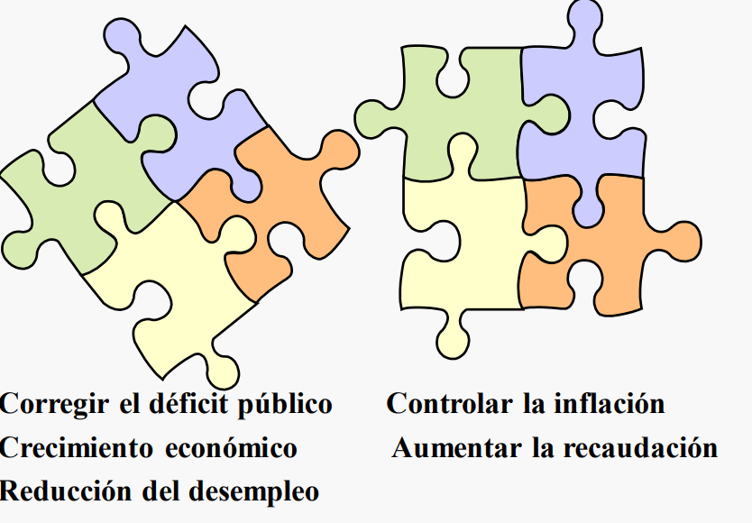

# Tema 1. Introducción.

## 1.1. Origen de la macroeconomía.

### 1.1.1. Objetivos.

La macroeconomía se ocupa del funcionamiento de la economía en su conjunto. Se trata de una ciencia aplicada, no exacta, que aborda cuestiones complejas, y a menudo urgentes, que afectan al bienestar de los ciudadanos.

Esta tiene diversos objetivos principales como lo son un crecimiento económico elevado o una baja tasa de desempleo. El problema esta en que muchos de estos objetivos están enfrentados:

Los principales objetivos de la política macroeconómica son:

- Crecimiento Económico.
- Pleno empleo.
- Estabilidad de precios: +- 2%.
- Equilibrio en la balanza de pagos.
- Equilibrio presupuestario público.

### 1.1.2. Tipos de política.

Para cumplir estos objetivos y reducir este conflicto de intereses existente, la macroeconomía cuenta con 4 herramientas principales:

- Política monetaria.
- Política fiscal.
- Política cambiaria.
- Políticas de oferta.

El objetivo subyacente de cada una de estas mediadas no es otro que el de influir en la **DEMANDA AGREGADA y OFERTA AGREGADA**. En este contexto, podemos distinguir dos tipos de planes de acción para influir en esta, son denominados **programas de ajuste estructural:**

**Medidas estabilizadoras que reducen la demanda agregada** (reducción de déficits
excesivos de los presupuestos públicos y de la balanza de pagos)

Menos gasto público de personal (despidos y rebajas salariales) y de funcionamiento (sanidad, educación…), menos subvenciones (transporte colectivo, electricidad…), y privatización de empresas públicas.

**Medidas estructurales, que actúan sobre la oferta agregada** (liberalizar la economía, abrirla al exterior, expandir el crédito al sector privado… y disminuir la presencia del sector público).

Reforma laboral, reducir las cotizaciones empresariales, suprimir las trabas
institucionales y administrativas que
dificultan la inversión privada, etc.

### 1.1.3. Teoría cuantitativa del dinero.

Hace bastante tiempo David Hume (1711-1776) ya estudió los vínculos entre la oferta monetaria, la balanza comercial y el nivel de precios. Los estudios monetarios de los siglos xviii y xix pusieron en evidencia las bases de la teoría cuantitativa del dinero, que aporta un esquema muy sencillo para entender la **relación existente entre la cantidad de dinero (oferta monetaria), los precios y la producción**, y que sirve de esqueleto teórico para el diseño de la política monetaria de muchos bancos centrales en la actualidad. Dicha relación queda recogida en la conocida ecuación cuantitativa del dinero (Irving Fisher, 1911):

$$
M \cdot V = P \cdot T                                           
$$

donde:

\\(M\\) = Cantidad total de dinero que, en promedio, ha estado en circulación en un país durante un período de tiempo determinado.

\\(V\\) = Velocidad media de circulación del dinero, o número de veces que, en promedio, se utiliza cada unidad monetaria en ese país y período para realizar transacciones económicas, que generan, a su vez, producción o valor añadido.

\\(P\\) = Nivel general de precios.

\\(T\\) = Cantidad total de bienes y servicios intercambiados en un país durante ese período.

La ecuación anterior viene a expresar que el gasto total de dicho país, en términos monetarios —primera parte de la ecuación—, coincide con el valor monetario de las mercancías intercambiadas —segunda parte de la ecuación—.

**Al existir una relación directa entre el número de transacciones económicas y la renta que se genera** (valor añadido o producción final), la segunda parte de la ecuación se puede identificar con el PIB nominal, por lo que la velocidad-renta del dinero será el cociente entre el PIB nominal y la oferta monetaria.
$$
M \cdot V = P \cdot Y_{R}
$$

$$
V = \frac{PIB_{Nominal}}{\text{Cantidad de dinero nominal}} = \frac{P \cdot Y_{R}}{M}
$$

$$
V = \text{Velocidad - Renta del dinero}
$$

$$
M = \text{Cantidad de dinero}
$$

$$
P = \text{Nivel de precios}
$$

$$
Y_{R} = \text{Nivel de producción o renta en términos reales}
$$

La velocidad-renta del dinero es el número de veces que la cantidad de dinero da vueltas al año para financiar el flujo de renta.

::: info
Basta suponer que la velocidad sea constante para concluir que **los incrementos de la oferta monetaria se traducirán en incrementos del PIB nominal** y, además, de mantenerse también constante el PIB real todos los incrementos de la oferta monetaria, se transformarán en aumentos proporcionales del nivel general de precios (teoría cuantitativa clásica).
:::

### 1.1.3. Teoría general del Empleo, el Interés y el Dinero.

En general, lo que dijo Keynes fue:

- Las economías de mercado no se autorregulan de forma suave.
- Un vuelco hacia el pesimismo en la comunidad empresarial induce una caída brusca en la inversión que, a su vez, puede provocar un descenso global de la producción y un aumento en el desempleo.
- Algunos precios claves de la economía, particularmente el nivel medio de salarios, no son muy flexibles.
- El gasto público, los impuestos y la política monetaria pueden utilizarse para suavizar las fluctuaciones económicas.

**Recetas keynesianas para la recesión o depresión**

**Causas**

- Poca demanda.
- Escasa inversión.
- Desconfianza.
- Ahorro excesivo.

**Efectos**

- \\(\uparrow\\) Desempleo.
- \\(\downarrow\\) Precios.
- \\(\downarrow\\) Compras en el exterior.
- \\(\uparrow\\) Ahorro.

**Prescripciones**

- Política fiscal expansiva:
  - \\(\uparrow\\) Gasto público.
  - \\(\downarrow\\) Impuestos.
- \\(\uparrow\\) Déficit público.
- \\(\uparrow\\) Cantidad de dinero.

### Recetas keynesianas para el crecimiento excesivo o sobrecalentamiento

**Causas**

- Exceso demanda.
- Mucha inversión.
- Euforia excesiva.
- Poco ahorro.

**Efectos**

- \\(\uparrow\\) Empleo (Suben salarios).
- \\(\uparrow\\) Precios.
- \\(\uparrow\\) Déficit exterior.

**Prescripciones**

- Política fiscal contractiva:
  - \\(\uparrow\\) Impuestos.
  - \\(\downarrow\\) Gasto público.
- \\(\uparrow\\) Superávit público.
- \\(\downarrow\\) Cantidad de dinero.

## 1.2. Escuelas de pensamiento.

En los 25 años siguientes a la segunda guerra mundial, los economistas se clasificaron en “keynesianos” y “no keynesianos”. En este primer periodo predominaron las ideas pro Keynes, pues el manejo de la política fiscal y monetaria que este promovía condujo a un periodo de estabilidad económica.

La crisis del petróleo de 1970 sucumbió al mundo en un período de *estanflación* insensible a las políticas keynesianas.

Esto llevó a la llamada contrarrevolución encabezada por **Milton Firedman** que defendían:

- Las políticas de estabilización eran en la práctica una fuente importante de inestabilidad.
- Las economías de mercado se autorregulan.
- La verdadera clave para la macroeconomía es una oferta monetaria estable.

La llamada escuela de la **nueva macroeconomía clásica** (Robert Lucas) mantiene que las políticas gubernamentales son ineficaces para estabilizar la economía (expectativas racionales).

### 1.2.1. Nueva escuela macroeconómica.

**Supuestos:**

- Todos los precios y salarios son flexibles con respecto a cambios en el nivel de precios esperados (un incremento en el nivel de precios esperado produce un desplazamiento hacia la izquierda de la oferta agregada).
- Los agentes utilizan toda la información para formar su expectativas y cometen errores diferentes.
- Particulares y empresas acomodan su comportamiento a la nueva información.
- Los anuncios y comportamientos del gobierno se incorporan a las expectativas.

>Las expectativas del público no permanecen fijas mientras el gobierno planea una «sorpresa», ya que el público revisará sus expectativas y las políticas macroeconómicas no tendrán un efecto predecible sobre el producto

El gobierno no puede saber el efecto de sus políticas si no conoce las expectativas del público respecto a la misma. Para reducir la incertidumbre sobre las políticas económicas, los nuevos clásicos sugieren que la autoridad monetaria persiga algún tipo de regla monetaria consistente con la estabilidad de precios.

Incluso desde la **Public Choice** se sostiene que la insuficiencia básica más importante de la doctrina de Keynes es de naturaleza política, al considerar de forma muy optimista, incluso ingenua, la posibilidad de una dirección inteligente de la economía por parte de los gobiernos elegidos popularmente.

### 1.2.2. Neokeynesianos.

Los neokeynesianos enfatizan la relevancia del Estado en la promoción y el fomento del crecimiento y el desarrollo económico. No están de acuerdo con la completa flexibilidad de los salarios y los precios ante incrementos en el nivel de precios esperados, y, aunque aceptan que las expectativas se pueden considerar racionales, asumen precios y salarios «algo» rígidos como consecuencia de, por ejemplo, los salarios nominales fijados por contrato, o precios «pegajosos». A diferencia del modelo neoclásico, sostienen que las políticas anticipadas no son completamente inefectivas, porque sí afectan al nivel de producción y al ciclo económico.

### 1.2.3. Posturas frente al estado y consenso.

**DESEMPLEO**

**Neokeynesianos**

- Se puede estimular la demanda agregada para favorecer el crecimiento económico y el empleo.
- No todo “el ajuste” debe recaer sobre los salarios.

**Neoliberales**

- El desempleo se debe básicamente a que los salarios son excesivamente elevados (crecen a un ritmo mayor que la productividad del trabajo).
- La negociación colectiva de salarios y condiciones laborales cercena la competitividad

**INFLACIÓN**

**Neokeynesianos**

- El control de la cantidad de dinero no es el único medio.
- Se debe garantizar la competitividad y la productividad con la intervención y regulación del Estado

**Neoliberales**

- Control estricto de los agregados monetarios.
- Se debe evitar todo exceso de liquidez sobre las necesidades que presenta la economía.

**DÉFICIT PÚBLICO**

**Neokeynesianos**

- Un déficit “productivo” puede ser admisible.
- El “efecto desplazamiento” no tiene necesariamente que darse.
- Los efectos redistributivos del gasto público son deseables.

**Neoliberales**

- El equilibrio presupuestario debe ser la norma.
- La intervención del sector público debe ser mínima.
- El “efecto desplazamiento” es muy importante.

| Neokeynesianos | Neoliberales 
| --- | --- |
| Sector público potente | Estado mínimo. |
| Mercados regulados. | Mercados (de bienes y financieros) poco regulados. |
| Política fiscal anticíclica. | Equilibrio presupuestario a ultranza |
| Enfoque en el corto plazo. | Énfasis en el largo plazo. |
| Regulación de la demanda global (consumo, inversión, gasto público y exportaciones netas). | Políticas de oferta o estructurales para mejorar la competitividad. |

**Consenso:**

- El equilibrio macroeconómico es deseable.
- Una tasa de inflación moderada crea un clima más favorable para la inversión, favorece la competitividad internacional, evita una escalada de precios y las distorsiones que se generan.
- Es importante conseguir un mercado de capitales desarrollado, capaz de promover el ahorro y de canalizarlo hacia la inversión.
- Una mayor competencia interna y externa en el sector privado favorece el crecimiento económico.
- Un sistema legal eficaz, junto a normas claras y estables de funcionamiento de las instituciones generan confianza a los agentes económicos.
- Capital humano, I+D+i, …consolidación fiscal…

## 1.3. Variables y relaciones macroeconómicas.

### 1.3.1. Brecha de producción.

La brecha de producción es una medida que compara la producción económica actual de un país con su capacidad económica máxima. Representa la diferencia entre el nivel real de producción (producto interno bruto real o PIB real) y el nivel potencial de producción (producto interno bruto potencial o PIB potencial).

- **Producción Actual (PIB Real):** Es la producción real de bienes y servicios en una economía en un período de tiempo específico.
- **Producción Potencial (PIB Potencial):** Es el nivel de producción que una economía podría alcanzar si todos los recursos productivos se utilizaran de manera eficiente. Representa el nivel máximo sostenible de producción a largo plazo.

Existen dos tipos de brechas de producción:

1. **Brecha Inflacionaria Positiva:** Ocurre cuando el PIB real está por encima del PIB potencial. Puede indicar presiones inflacionarias debido a que la economía está operando a un nivel superior al que puede mantener a largo plazo.
2. **Brecha Inflacionaria Negativa:** Ocurre cuando el PIB real está por debajo del PIB potencial. Puede indicar una capacidad no utilizada en la economía y puede estar asociada con recesiones o desempleo.

>El concepto de brecha de producción es fundamental para entender la salud general de una economía y orientar las políticas macroeconómicas. Cuando la brecha de producción es positiva, los formuladores de políticas pueden considerar medidas para frenar la inflación, mientras que una brecha negativa puede sugerir la necesidad de políticas para estimular la demanda y reducir el desempleo.

### 1.3.2. El desempleo.

El desempleo se considera "malo" desde una perspectiva económica y social por varias razones:

1. **Impacto en Individuos y Familias:**
    - **Inseguridad Financiera:** El desempleo puede resultar en una pérdida significativa de ingresos, lo que lleva a la inseguridad financiera para los individuos y sus familias.
    - **Estrés y Salud Mental:** La falta de empleo a menudo está asociada con el estrés y la ansiedad, lo que puede tener impactos negativos en la salud mental.
2. **Costes Sociales:**
    - **Crecimiento de la Pobreza:** El desempleo puede contribuir al crecimiento de la pobreza, ya que las personas desempleadas pueden enfrentar dificultades para satisfacer sus necesidades básicas.
    - **Desigualdad Social:** El desempleo puede agravar las desigualdades sociales y económicas, ya que ciertos grupos de la población pueden verse más afectados que otros.
3. **Costes Económicos:**
    - **Pérdida de Producción:** Cuando las personas no están empleadas, la producción económica puede sufrir debido a la pérdida de habilidades y recursos productivos.
    - **Ciclo Económico:** El desempleo también puede ser un indicador de problemas económicos más amplios y contribuir a los ciclos económicos recesivos.
4. **Desperdicio de Recursos:**
    - **Subutilización de Habilidades:** El desempleo a menudo significa que algunas personas están subutilizando sus habilidades y educación, lo que representa un desperdicio de recursos humanos.
    - **Desincentivos para la Participación Laboral:** En áreas con altas tasas de desempleo, puede haber desincentivos para que las personas participen en la fuerza laboral, lo que puede llevar a una disminución de la productividad a largo plazo.
5. **Impacto en la Cohesión Social:**
    - **Tensión Social:** Las altas tasas de desempleo pueden contribuir a la tensión social y a la desconfianza en las instituciones, ya que las personas pueden sentirse desfavorecidas por el sistema.

Es importante señalar que la visión del desempleo como algo "malo" no es universalmente compartida. Desde ciertas perspectivas económicas, como la teoría del ciclo económico, ciertos niveles de desempleo pueden ser considerados naturales. Además, el desempleo puede tener causas estructurales y cíclicas que requieren enfoques diferentes para abordar sus raíces.

**1.3.2.1. Fórmulas.**

La tasa de paro o desempleo muestra el grado de fracaso del mercado de trabajo al poner en relación los desempleados con el número de personas activas. Se calcula para ambos sexos y para cada uno de ellos por separado.

También se puede calcular para un período de edad determinado

La tasa de actividad muestra el grado de disposición de la población por incorporarse a la vida laboral

La tasa de ocupación o de empleo es un indicador del grado de absorción del mercado de trabajo

**1.3.2.2. Tipos de desempleo.**

1. **Desempleo Friccional:**
    - Ocurre cuando las personas están entre trabajos o buscan empleo por primera vez.
    - Es temporal y suele ser considerado normal en una economía dinámica.
    - Representa la mínima cantidad de desempleo que puede existir en una economía.
2. **Desempleo Estructural:**
    - Se debe a desajustes entre las habilidades de los trabajadores y los requisitos del mercado laboral.
    - Puede persistir incluso cuando la economía está funcionando a su máximo potencial.
3. **Desempleo Cíclico:**
    - Relacionado con las fluctuaciones económicas y los ciclos de expansión y contracción.
    - Aumenta durante recesiones y disminuye durante periodos de crecimiento económico.
4. **Desempleo Estacional:**
    - Ocurre debido a variaciones estacionales en la demanda de ciertos trabajos.
    - Por ejemplo, la agricultura o el turismo pueden experimentar desempleo estacional.

**1.3.2.3. Tasa natural de desempleo.**

Es la tasa normal de desempleo en torno a la que fluctúa la tasa de desempleo real. Es el objetivo en torno al empleo al que debe tender la política económica.

>Si un nivel de desempleo friccional es inevitable y muchas economías sufren además desempleo estructural, una cierta tasa de desempleo es normal o “natural”.

**1.3.2.4. Hipótesis de histéresis en el mercado de trabajo.**

- *Resistencia para Reducir el Componente Estructural del Desempleo:*
    - La resistencia para reducir el desempleo estructural puede ser parte de la hipótesis de histéresis. Si las condiciones estructurales del mercado laboral son rígidas o poco flexibles, las tasas de desempleo pueden persistir incluso en períodos de crecimiento económico.
- *Poca Flexibilidad del Mercado Laboral:*
    - La poca flexibilidad en el mercado laboral puede contribuir a la histéresis, ya que las condiciones rígidas pueden hacer que la adaptación a cambios en la demanda laboral sea más difícil.
- *Descubrimiento de Vías Alternativas al Trabajo:*
    - La hipótesis de histéresis sugiere que los desempleados pueden encontrar vías alternativas de subsistencia, como rentas del sector público, subsidios de desempleo o ayudas familiares. Esto puede contribuir a la persistencia del desempleo.
- *Fase Expansiva y Obstáculos para la Contratación:*
    - Después de una fase recesiva, la hipótesis de histéresis sugiere que, incluso durante la fase expansiva, los empresarios pueden ser renuentes a contratar a personas que han estado desempleadas, asumiendo que han quedado obsoletas en conocimientos y actitudes. Esto puede contribuir a la persistencia del desempleo estructural.

### 1.3.3. Ley de Okun.

Ley de Okun (regularidad empírica -descubierta en 1962- que varía entre países y con el paso del tiempo) determina una relación estable entre el crecimiento económico y el empleo.

$$
u_{t}-u_{t-1} = -\beta \left ( g_{y}-g_{y\bar{}} \right )
$$

donde:

\\(u_{t}-u_{t-1}\\) es la variación del desempleo en un momento determinado del tiempo.

\\(\beta\\) mide la respuesta del desempleo ante las diferencias entre las tasas de producción actual y potencial.

\\(\left ( g_{y}-g_{y\bar{}} \right )\\) brecha de producción.

>Existe una relación inversa entre la tasa de desempleo y la producción.

Esta ley nos determina una regularidad empírica, que no tiene porque cumplirse siempre, algunos factores que pueden influir en esto son:

- Las empresas atesoran el trabajo y hay un número mínimo de trabajadores que se requieren sin tener en cuenta la producción (muchas empresas pueden producir más sin aumentar el número de trabajadores).
- El incremento de la productividad hace posible producir más sin, necesariamente, contratar a más trabajadores.
- Para que se reduzca el desempleo, la población activa tiene que crecer menos que el empleo (al aumentar el empleo tiende a aumentar la población activa que busca empleo).

### 1.3.4. Inflación.

**1.3.4.1. Efectos de la inflación.**

- Pérdida de competitividad del país o zona geográfica.
- Genera incertidumbre para las inversiones y los planes de producción de las empresas.
- Dificulta el cálculo de los precios relativos.
- Origina el pago de mayores impuestos (incluso en términos reales si los impuestos son progresivos y las tarifas no son deflactadas).
- Las clases sociales menos dinámicas y los pensionistas suelen perder poder adquisitivo.

**1.3.4.2. Inflación anticipada y no anticipada.**

- Inflación anticipada (los agentes económicos la habían previsto con anterioridad y contrataron de acuerdo a la misma- salarios, tipos de interés…-):
    - Aumento del coste de tener liquidez.
    - Costes de cambio de menú.
- Inflación no anticipada (pilla por sorpresa):
    - Redistribución de renta y riqueza.
    - Beneficia a los deudores y perjudica a los acreedores.

**1.3.4.3. Relación entre crecimiento e inflación.**

- Un elevado crecimiento tiende a provocar inflación.
- Una reducción del crecimiento tiende a provocar desinflación (descenso del nivel de inflación).
- Un crecimiento negativo puede provocar deflación.

### 1.3.5. Curva de Phillips.

La Curva de Phillips es una relación empírica que muestra la supuesta relación inversa entre la tasa de inflación y la tasa de desempleo en una economía. Fue propuesta por el economista A. W. Phillips en un estudio que examinaba la relación entre el desempleo y la inflación en el Reino Unido durante la década de 1950.

La idea central de la Curva de Phillips es que existe una relación de corto plazo entre la tasa de inflación y la tasa de desempleo. La formulación básica sugiere que cuando la tasa de desempleo es baja, la tasa de inflación tiende a ser alta, y viceversa. Sin embargo, esta relación no es sostenible a largo plazo debido a las expectativas adaptativas de los agentes económicos.

La versión original de la Curva de Phillips se basa en la idea de que existe una relación inversa entre la tasa de desempleo y la tasa de aumento de los salarios nominales. En un mercado laboral ajustado, los trabajadores tienen más poder de negociación, lo que puede llevar a aumentos salariales más rápidos. Estos aumentos salariales, a su vez, pueden contribuir a mayores niveles de inflación.

Es importante destacar que la Curva de Phillips original ha sido objeto de críticas y desarrollos teóricos posteriores. Por ejemplo, la introducción de las expectativas racionales sugiere que la relación inversa entre la inflación y el desempleo solo puede mantenerse a corto plazo, ya que los agentes económicos ajustan sus expectativas en respuesta a cambios en la política económica.

La curva de Phillips: Inflación y desempleo en los EE UU (1948-1969)

La existencia de una relación empírica, aparentemente fiable, unida a una explicación razonable (con más empleo más inflación), llevó a los macroeconomistas y a las autoridades económicas a aceptar con rapidez la curva de Phillips.

Las políticas macroeconómicas en la década de 1960 tenían por objetivo mantener el desempleo en el intervalo que parecía coherente con una inflación moderada.

Los datos de EE UU muestran que entre 1961 y 1969, la tasa de desempleo disminuyó continuamente, pasando del 6,7 al 3,5 por ciento; la tasa de inflación aumentó ininterrumpidamente, pasando del 1 al 5,4 por ciento.

A partir de 1970, la relación se rompió, y no parece existir ninguna relación entre la tasa de desempleo y la tasa de inflación.

La curva de Phillips: Inflación y desempleo en los EE UU (1970-1998)

A finales de los 60, e incluso mientras la curva original de Phillips aún describía satisfactoriamente los datos, Milton Friedman y Edmund Phelps pusieron en duda la relación inicial entre el desempleo y la inflación.

Sostenían que sólo podía existir esa relación si los encargados de fijar los salarios predecían
sistemáticamente una inflación inferior a la efectiva (hecho improbable).

Friedman introdujo el concepto de la "tasa natural de desempleo" para argumentar que, a medida que las expectativas de inflación se ajustan, la economía se mueve hacia una tasa de desempleo a largo plazo, independiente de la tasa de inflación. Friedman sostenía que las políticas monetarias y fiscales expansivas podrían reducir temporalmente la tasa de desempleo por debajo de su nivel natural, pero solo a expensas de tasas de inflación más altas.

Si el gobierno intentaba mantener un desempleo más bajo aceptando una inflación más alta, la relación acabaría desapareciendo y la tasa de desempleo no podría mantenerse por debajo de un determinado nivel que llamaban “tasa natural de desempleo”.

Una versión mas moderna y verídica de la curva de Phillips sería:

$\\(\pi = \pi^{e} - \varepsilon \left ( u-u^{*} \right )\\)$

donde:

\\(\pi\\) es la tasa de inflación.

\\(\pi^{e}\\) es la tasa de inflación esperada.

\\(\varepsilon\\) es el coeficiente que relaciona la variación de la inflación con la diferencia existente entre la tasa de desempleo del periodo y la tasa natural de desempleo.

\\(u\\) es la tasa de desempleo.

\\(u^{*}\\) es la tasa natural de desempleo.

>Tanto la inflación como el desempleo se representan en porcentajes.

En esta gráfica se muestra la curva de Phillips a corto plazo (pendiente negativa) y la curva de Phillips a largo plazo (recta vertical). **Esto es ya que a lago plazo, como dijo Friedman, la tasa de desempleo se sitúa en la tasa natural de desempleo. Por otro lado en la curva de a corto plazo es negativa, reflejando la relación inversa comentada antes.**

La tasa natural de desempleo se dará cuando:

$$
( u-u^{*}) = 0
$$

es decir, cuando se cumplan las espectativas de inflación.

>Podemos concluir por tanto que cuando la inflación está por encima de la inflación esperada el desempleo es menor que el desempleo natural y viceversa.

## 1.4. Ecuación macroeconómica fundamental de endeudamiento.

$$
S-I=(G+TR-TA)+XN
$$

Esta identidad establece que el exceso de ahorro sobre la inversión del sector privado (S-I) es igual al déficit del sector público (G+TR-TA), más el superávit comercial (XN). Si el ahorro del sector privado coincide con la inversión, el déficit (superávit) del sector público se corresponde con el déficit (superávit) del sector exterior.

En la medida en que un sector gasta más de lo que recibe, tiene que pedir prestado a los otros sectores. El sector privado puede prestar sus ahorros:

- A las empresas para que inviertan
- Al sector público (que gastará más de lo que recauda por impuestos)
- Al sector exterior, para que puedan comprar los extranjeros más de lo que venden al país

## 1.5. Marcos temporales de los modelos.

Casi todos los especialistas en macroeconomía se adhieren a tres modelos que están reflejados en los libros de texto, pero las opiniones difieren en cuanto al marco temporal en el que opera cada uno de ellos, e incluso en su denominación (corto, largo y muy largo plazo). Del estudio de la macroeconomía en el **muy largo plazo** se ocupa la teoría del crecimiento económico y, en este caso, el marco temporal suscita poca controversia. Se trata de analizar cómo la acumulación de capital físico, capital humano y avances tecnológicos permiten aumentar el nivel de vida de los ciudadanos. No se abordan las fluctuaciones de la economía en el corto plazo ni las fases de bajo empleo, consumo e inversión. Lo que más importa en este modelo es el ritmo al que crece la economía en promedio y dar respuesta a la pregunta: ¿por qué unos países crecen más lentamente que otros?

El modelo de **largo plazo** consiste esencialmente en representar la economía cuando las cuantías de capital y el estado de la tecnología pueden considerarse fijos, aunque se dé cabida a trastornos temporales, como los shocks adversos de oferta agregada. La curva de oferta agregada (OA) representa, para cada nivel de precios, la cuantía de producción que las empresas están dispuestas a realizar, y su posición depende de la capacidad productiva de la economía. La curva de la demanda agregada (DA) representa, para cada nivel de precios, la producción o renta en la que los mercados de bienes y de activos financieros se encuentran simultáneamente en equilibrio. Su posición depende tanto de las políticas monetaria y fiscal, como de la confianza de los consumidores y empresarios.

En el **largo plazo** se supone que todos los recursos productivos están plenamente empleados y que la curva de oferta agregada es vertical (los macroeconomistas debaten si el largo plazo abarca un período de varios trimestres o una década). En este período, la producción está determinada solamente por la oferta agregada, mientras que los precios están determinados tanto por la oferta como por la demanda agregadas. Las tasas de inflación muy elevadas se deben siempre, en última instancia, a cambios en la demanda agregada originados por incrementos considerables de la oferta monetaria.

En el modelo de **corto plazo** los precios se consideran esencialmente fijos, y son las fluctuaciones de la demanda agregada las que determinan el nivel de aprovechamiento de la capacidad productiva disponible y, por tanto, el nivel de producción y empleo de la economía. Por ser la curva de oferta agregada horizontal (plana), es el ámbito donde las políticas de demanda agregada tienen mayor aplicación (modelo IS-LM). Cuando se estudia sólo la demanda agregada no es que se ignore la curva de oferta agregada, sino que se está suponiendo que ésta es horizontal y, por tanto, que el nivel de precios es constante.
