# Tema 3. Los mercados financieros.

## 3.1. Activos financieros.

Un activo financiero es un título **emitido con las unidades económicas con déficit de fondos** y **adquirido por las unidades con superávit**. Además de transferir fondos transfiere riesgos.

Hay gran cantidad de productos financieros distintos como lo son los depósitos a la vista, de ahorro y a plazo; la renta fija; la renta variable…

### 3.1.1. Activos financieros y riqueza real.

Considerando la economía en su conjunto todos los activos financieros se cancelan puesto que todo activo financiero tiene como contrapartida un pasivo y por lo tanto:

$$
\sum{A}=\sum{P}
$$

En una agregación total de la economía la riqueza estaría constituida solamente por activos reales, que junto al capital humano constituye el capital real.

La riqueza se subdivide en **activos reales** y **activos financieros:**

**Activos Reales:**

- Representan posesiones *tangibles* con un valor intrínseco.
- Ofrecen *protección contra la inflación* al estar vinculados a bienes tangibles como inmuebles, materias primas y oro.
- Generan *rentas periódicas*, proporcionando ingresos pasivos a lo largo del tiempo.
- Permiten un *mayor control* en comparación con los activos financieros.

**Activos Financieros:**

- Destacan por su *liquidez*, como en el caso de acciones y fondos de inversión, permitiendo una fácil compra y venta.
- Facilitan la *diversificación en la cartera*, una estrategia clave para minimizar riesgos al invertir en diferentes instrumentos financieros.
- Ofrecen *accesibilidad* a una amplia gama de mercados financieros y activos.

### 3.1.2. Bonos.

Un bono del estado es un instrumento financiero emitido por el gobierno de un país para obtener financiamiento. También se conoce comúnmente como "bono soberano". Cuando un gobierno emite bonos del estado, está efectivamente pidiendo prestado dinero de inversionistas y comprometiéndose a devolver el capital prestado en una fecha futura, conocida como fecha de vencimiento, y a pagar intereses periódicos durante la vida del bono.

Características clave de los bonos del estado:

1. **Emisor:** El emisor es el gobierno soberano, ya sea a nivel nacional, estatal o local, dependiendo de la jurisdicción.
2. **Fecha de Vencimiento:** Es la fecha en la que el gobierno debe devolver el capital prestado a los inversores. Los bonos pueden tener vencimientos a corto, mediano o largo plazo.
3. **Intereses:** Los bonos del estado generalmente pagan intereses periódicos, conocidos como cupones. El tipo de interés, también llamado rendimiento o cupón, se establece en el momento de la emisión.
4. **Seguridad:** En muchos casos, los bonos del estado se consideran inversiones seguras porque están respaldados por la capacidad del gobierno para recaudar impuestos. Sin embargo, la seguridad de los bonos depende de la solidez financiera y crediticia del gobierno emisor.
    
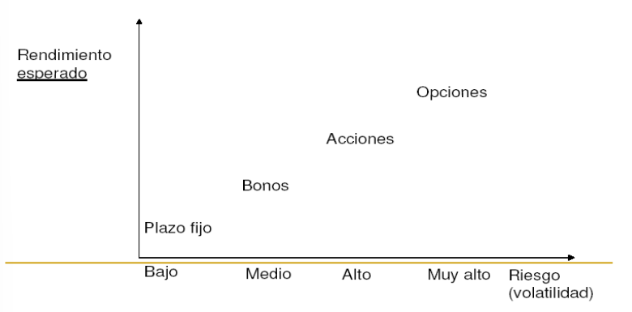
    

    
5. **Riesgo de Tasa de Interés:** Los precios de los bonos pueden fluctuar en respuesta a cambios en las tasas de interés del mercado. Cuando las tasas de interés aumentan, el valor de los bonos existentes tiende a disminuir, y viceversa.
6. **Instrumento de Inversión:** Los bonos del estado son populares entre los inversores que buscan ingresos regulares y estabilidad en sus carteras.

La emisión de bonos del estado es una forma común para que los gobiernos obtengan fondos para financiar proyectos, programas gubernamentales o para cubrir déficits presupuestarios. La capacidad de un gobierno para cumplir con sus obligaciones de pago de deuda se evalúa a través de su calificación crediticia, proporcionada por agencias de calificación crediticia.

Tenemos dos mercados distintos para adquirir un bono:

1. **Mercado Primario:**

El mercado primario es el lugar donde se emiten por primera vez los valores financieros, como acciones y bonos. En este mercado, las empresas o entidades gubernamentales venden directamente nuevos valores a los inversores. La emisión de nuevos valores en el mercado primario permite a las empresas recaudar capital para financiar sus operaciones o proyectos.

2. **Mercado Secundario:**

El mercado secundario es donde los inversores compran y venden valores que ya han sido emitidos en el mercado primario. En este mercado, los valores se intercambian entre inversores, y el dinero proveniente de la compra y venta de estos valores va directamente de un inversor a otro, no a la empresa emisora.

En cuanto a la al periodo de los pagos de intereses podemos distinguir:

**Cupón Cero:**

- No pagan nada hasta el vencimiento.
- Son emitidos a un precio menor al valor nominal del instrumento (se les llama títulos de descuento).
- El rendimiento que se obtiene es la diferencia entre el precio de emisión (o compra) y el precio de rescate (o venta). Esta diferencia será el *“interés implícito”* que ganará el inversor.

**De Amortización (se pagan intereses y se devuelve el capital - al final o periódicamente):**

- El tipo de interés puede ser fijo o variable (Tasa de referencia, con o sin plus).

**3.1.2.1. Rendimientos de los bonos.**

>Los precios de los bonos y, en general, de los títulos y los rendimientos o tasas de interés se mueven en direcciones opuestas

Veamos esto con un ejemplo:

| Valor Nominal (VN) | Pago anual de intereses 5% (\\(i_{n}\\)) | Tipo de interés del mercado (\\(i_{e}\\)) | Cotización o precio de mercado |
| --- | --- | --- | --- |
| 100 | 5 | 5% | 100 |
| 100 | 5 | 4% | 125 |
| 100 | 5 | 10% | 50 |

Céteris páribus, cuanto más alta es la cotización de un bono, más bajo es su tipo de interés efectivo.

Si el tipo de interés del mercado es del 10% nadie querrá pagar 100 euros por un título que rinde sólo el 5%. El precio del bono tenderá a bajar hasta que el 10% del precio de mdo. sea = al 5% del valor nominal:

$$
(i_{e})(VC)=(i_{n})(VN)
$$

### 3.1.3. Función de los mercados financieros.

El sistema financiero tiene la importante función de transformas los ahorros en fondos para la inversión.

>La interconexión del sistema financiero global hace que si un país quiebra, o entra en gran recesión, el sistema bancario de los países acreedores se enfrenta a pérdidas.

**3.1.3.1. Críticas a los mercados financieros internacionales.**

**Flujos de Capitales y Dinero:**

- Los flujos de capitales y dinero se vuelven cada vez más autónomos respecto al rendimiento real de las economías.

**Transformación del Dinero:**

- El dinero se convierte en el objeto de los intercambios, alejándose de su condición originaria de instrumento para facilitar las inversiones y el comercio.

**Relación con las Entidades Sistémicas:**

- Las entidades sistémicas son ayudadas por los Estados, lo que se traduce en la socialización de pérdidas y la privatización de beneficios.

**3.1.3.2. Agencias de rating.**

**Agencias de Calificación Crediticia:**

- Son entidades privadas que valoran los productos financieros y evalúan su riesgo.

**Importancia y Poder:**

- Representan el ejercicio de un poder significativo, incluso por encima de los Estados.

**Impacto en los Mercados:**

- La publicación de sus calificaciones desencadena oleadas de cuantiosos fondos en los mercados.

**Influencia en los Movimientos de Capitales y Endeudamiento:**

- Condicionan el rumbo de los movimientos de capitales e incluso la capacidad de endeudamiento de los países.

**Características Críticas de las Agencias de Calificación Crediticia:**

- Son brutalmente procíclicas.

**Dominio Oligopólico:**

- Constituyen un oligopolio.

**Frecuentes "Errores de Bulto" en Informes:**

- Sus informes, con demasiada frecuencia, tienen "errores de bulto".

**Intereses Financieros Globales:**

- Los principales propietarios (accionistas) de las agencias tienen intereses financieros mundiales.

**Distorsión de la Atención:**

- Son "ideales" para distraer la atención de los verdaderos problemas económicos de los países o empresas.

## 3.2. La demanda de dinero.

La *demanda de dinero de saldos reales*, definida como la demanda nominal dividida por el nivel de precios, es la proporción de riqueza que los agentes económicos desean mantener como dinero (en forma de liquidez plena).

Mantener riqueza en forma de dinero conlleva un coste de oportunidad porque:

1. Se pierde el tipo de interés que se consigue (normalmente) con inversiones en activos menos líquidos y/o más arriesgadas.
2. Se sufre el coste de la inflación (a más inflación mayor coste).

El tipo de interés nominal tiende a recoger la inflación.

### 3.2.1. Ecuación de Fisher.

La ecuación de Fisher representa la diferencia entre el tipo de interés nominal y el tipo de interés real:

$$
i=r+\pi
$$

donde:

\\(i\\) = El tipo de interés nominal.

\\(r\\) = El tipo de interés real.

\\(\pi\\) = La tasa de inflación.

Muestra que el tipo de interés nominal puede variar por dos causas:
1. Porque el tipo de interés real varía.
2. Porque la tasa de inflación varía.

>El tipo de interés real puede ser negativo si la tasa de inflación > tipo de interés nominal.

**¿Diferencia (exacta) entre el tipo de interés nominal y real?**

$$
(1+i_{r})=\frac{1+i_{n}}{1+\pi}
$$

### 3.2.2. Motivos para demandar dinero (Keynes).

1. **Transacciones**: Uso del dinero como medio de cambio (depende del nivel de renta, el tipo de interés y los costes de cambiar bonos por dinero).
2. **Precaución**: Individuos y empresas lo demandan para hacer frente a circunstancias imprevistas (depende del grado de incertidumbre, tipo de interés, costes de falta de liquidez).
3. **Por motivo especulación (o como activo)**: Los individuos y/o empresas que deseen comprar acciones o bonos, pueden preferir retrasar la compra si creen que sus precios van a bajar. Mientras tanto, mantendrán saldos de dinero como depósito de valor. También tiene su origen en la incertidumbre respecto al valor monetario de otros activos que puede poseer un individuo o empresa.

### 3.2.3. La trampa de la liquidez.

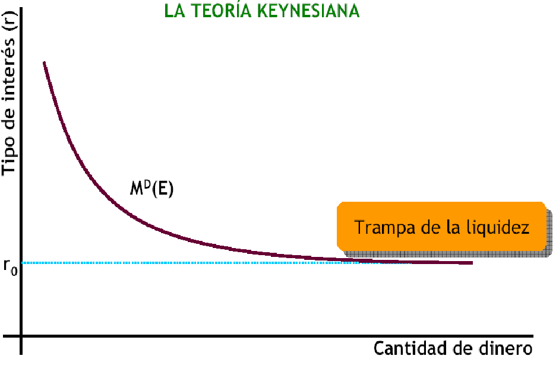

Para niveles muy bajos de tipos de interés, las expectativas de subida de los mismos determinan que no se demanden bonos ante posibles pérdidas de capital, lo que hace que la curva de demanda de dinero sea completamente elástica.

La trampa de la liquidez cuestiona el mecanismo de transmisión monetaria y hace inefectiva a la política monetaria. 

Si la economía está deprimida y la tasa de interés es muy baja, un aumento de la cantidad de dinero puede no hacer bajar el tipo de interés, y el público mantiene todo el dinero adicional como tal, en lugar de comprar bonos, el dinero caería en la trampa de la liquidez.

### 3.2.4. La demanda de dinero.

La demanda de dinero se representa gráficamente con relación al tipo de interés.

La demanda de dinero se expresa:
$$
L=kY-hi
$$

$$
k, h\geq 0
$$

donde:
- \\(L\\) es la demanda de dinero.
- \\(Y\\) es la renta.
- \\(i\\) es el tipo de interés.
- \\(k\\) es la sensibilidad de la demanda de saldos reales al nivel de renta.
- \\(h\\) es la sensibilidad de la demanda de saldos reales al tipo de interés.

**Determinantes de la demanda total de dinero**

- La renta nacional (un aumento de la renta eleva la demanda de dinero en una proporción menor, es decir, la elasticidad renta de la demanda de dinero es menor que 1)
- El coste de transferencia o comisión de gestión.
- El tipo de interés.
- La estación del año, mes e incluso periodo más reducido.
- La mayor utilización de las tarjetas de crédito en años recientes ha reducido la demanda para transacción y por precaución.
- La riqueza
- Las expectativas de inflación

## 3.3. La oferta monetaria.

La **oferta monetaria** (\\(M1\\)) es la cantidad de dinero que hay en circulación en una economía en un momento determinado. La oferta monetaria está formada por el dinero en efectivo que hay en manos del público y los depósitos bancarios a la vista.

El efectivo en manos del público (EMP) es
una parte del total de efectivo, del total de
la circulación fiduciaria o del total de
dinero legal (en circulación).

Existe una parte del efectivo total que está en las cajas bancarias, y otra que las instituciones
bancarias mantienen en el Banco de España en
forma de depósitos (Activos de Caja del Sistema
Bancario, ACSB).

$$
\text{Base monetaria}=\text{Circulación fiduciaria en manos del público y en las
cajas bancarias}+\text{ACSB} = M0
$$

La base monetaria o \\(M0\\) es el equivalente al las monedas en circulación más las reservas bancarias. Este, como veremos en el siguiente apartado, juega un papel fundamental en la política monetaria.

### 3.3.1. El papel del banco central.

A las autoridades monetarias corresponde el control de todo el proceso de creación de dinero. Y el control de la oferta monetaria (\\(EMP + Dv\\)) o cantidad de dinero en circulación.

Esto se hace porque **la oferta monetaria es un múltiplo de la base monetaria**

El banco central puede controlar la oferta monetaria (M) actuando sobre la base monetaria y/o el multiplicador monetario.

Por ejemplo, si aumenta la base monetaria también aumenta la oferta monetaria, pero no afecta al multiplicador.

Dado que el Banco Central controla la base monetaria podría controlar de forma precisa la OM, siempre que el multiplicador monetario fuese constante o plenamente predecible.

$$
M=\frac{e+1}{e+r}B
$$

donde:
- \\(M\\) es la oferta monetaria.

- \\(B\\) es la base monetaria.

- \\(e\\) es el coeficiente de caja.

- \\(r\\) es el coeficiente de reservas.

**Coeficiente de Caja (\\(e\\)):**

Este coeficiente indica la fracción de la base monetaria que el público mantiene como efectivo en lugar de depositarla en bancos. Cuanto menor sea e, mayor será la proporción de la base monetaria que se destina a reservas y, por lo tanto, mayor será el potencial de multiplicación del dinero.

**Coeficiente de Reservas (\\(r\\)):**

Este coeficiente indica la fracción de los depósitos que los bancos deben mantener como reservas. Un coeficiente de reservas más bajo (r) significa que los bancos pueden prestar más dinero y, por lo tanto, generar un mayor multiplicador monetario.

### 3.3.2. El balance del banco central.

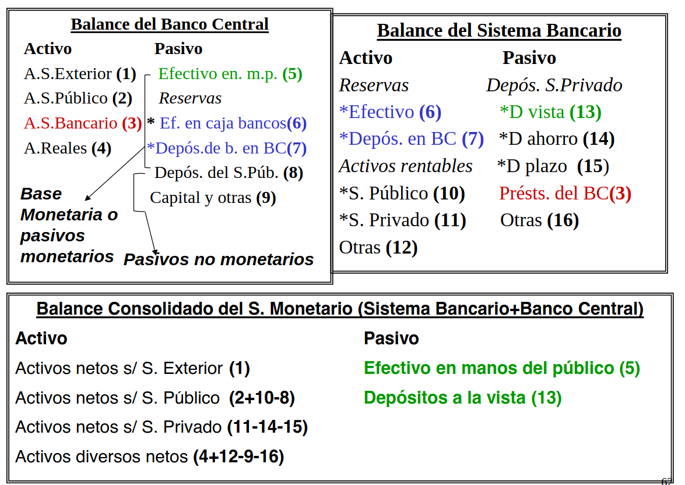

Observando la evolución del balance consolidado del sistema monetario se puede conocer cuales han sido los factores que han provocado las posibles modificaciones en la oferta monetaria de un periodo determinado.

Del balance del Banco Central visto en la _Figura 7_ podemos ver que:

$$
BM=EMP+RB
$$

$$
BM=\text{Total activos BC}-\text{Pasivos no monetarios BC}
$$

Por tanto, toda expansión de los activos del Banco Central sin que tenga lugar una variación de los pasivos no monetarios conduce a una expansión de la base monetaria y viceversa (contracción de los activos sin variación de los pasivos no monetarios conduce a una reducción de la base monetaria).

Es decir, si el banco central compra activos (aumento de las reservas de divisas, crédito al sistema bancario ó del créditos del sector público), la base monetaria aumenta **siempre que los pasivos no monetarios permanezcan constantes**.

De igual manera una disminución de los pasivos no monetarios conduce a una expansión de la base monetaria.

### 3.3.3. Factores para que el sector bancario funcione.

- La **confianza** es clave para que el sistema bancario funcione, pero los depósitos son líquidos sólo si su ritmo de retirada es el normal y puede ser atendido con los nuevos ingresos y las reservas líquidas de los bancos. El temor a que un banco que no devuelva los depósitos puede llevar a un pánico bancario.

- El **Fondo de Garantía de Depósitos**, creado por las autoridades monetarias y los bancos, respalda una parte de los depósitos (la cantidad asegurada por depositante en cada institución financiera ha sido recientemente elevada a 100.000€.)

- El riesgo para los depositantes es mayor cuanto más arriesgadas son las inversiones de los bancos (**hipotecas subprime y derivados**)

- Una forma de reducir esos riesgos es imponer más **regulaciones** a los bancos que les obliguen a poseer sobre todo activos líquidos y seguros y limiten su acumulación de riesgos.

## 3.4. El equilibrio en los mercados financieros: La curva LM.

El mercado de dinero viene determinado por:
- El deseo del público de tener dinero **(curva de demanda de dinero)**.
- La política monetaria del Banco Central **(oferta monetaria que se puede considerar fija)**.

La interdependencia de ambas determina el **tipo de interés del mercado**.
En el **equilibrio**, la demanda de saldos reales es igual a la oferta de saldos reales.

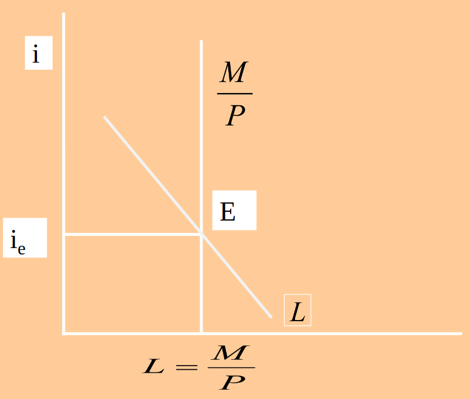

Centrados en la riqueza financiera, se puede suponer que **sólo hay dos activos**: el dinero y todos los demás que se denominan bonos. Cada individuo tiene que decidir cómo distribuir su riqueza. Una mayor cantidad de bonos significa mayores restricciones de liquidez e intereses más elevados.

La restricción presupuestaria de la riqueza implica que cuando el mercado de dinero se encuentra en equilibrio el mercado de bonos también se encuentra en equilibrio. Así
mismo, cuando hay un exceso de demanda en el mercado de dinero hay un exceso de oferta de bonos. En consecuencia podemos analizar totalmente los mercados de activos financieros centrando la atención en el mercado de dinero.

- Por ejemplo, un incremento de la producción, desplaza la curva de demanda hacia la derecha, por lo que is partimos de una oferta monetaria dada: La demanda de dinero aumenta, esto lleva a una situación de escasez y a una venta de bonos, que hace que el precio de estos últimos baje. Como consecuencia, el tipo de interés bajará hasta lacanzar el equilibrio.

- De forma análoga, una reducción de la producción desplaza la curva de demanda hacia la izquierda, por lo que la demanda de dinero disminuye, esto lleva a una situación de exceso de oferta y a una compra de bonos, que hace que el precio de estos últimos suba. Como consecuencia, el tipo de interés subirá hasta alcanzar el equilibrio. 

### 3.4.1. La política monetaria.
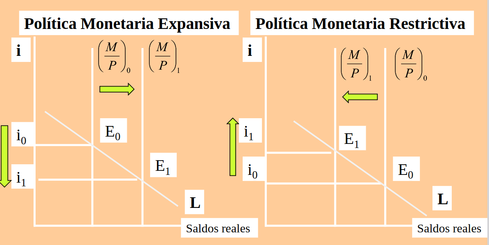

La **Política Monetaria** se refiere a las decisiones que las autoridades monetarias toman para alterar el equilibrio en el mercado de dinero, es decir, para modificar la cantidad de dinero o el tipo de interés.

El B. Central no puede fijar simultáneamente el tipo de interés y la cantidad de dinero.

A corto plazo el B. Central puede controlar con más precisión los tipos de interés que la cantidad de dinero.

$$
M\cdot V = PIB_{real} \cdot P
$$

La velocidad de circulación **no es constante en el corto plazo**. Depende en buena medida de las expectativas de los distintos agentes económicos que demandan y utilizan el dinero, de la flexibilidad de los mercados financieros, de los hábitos de consumo, de las expectativas respecto a la inflación y de la confianza de los agentes respecto al crecimiento de la economía.

Cuando los agregados monetarios se vuelven relativamente inestables, las autoridades monetarias deben utilizar el tipo de interés en lugar de la oferta monetaria como objetivo directo.

#### 3.4.1.1 Política monetaria expansiva.

La política monetaria expansiva es una política económica que consiste en aumentar la cantidad de dinero en circulación, lo que se conoce como oferta monetaria, con el objetivo de aumentar la actividad económica y reducir el desempleo.

Esta tendra por objetivo **aumentar la oferta monetaria, lo que implicará una bajada en los tipos de interés**.

Las herramientas que tiene el banco central a su disposición para conseguir esto son:

- Compra de títulos en el mercado abierto.
- Reducción del coeficiente legal de caja.
- Conceder a los bancos nuevos créditos.

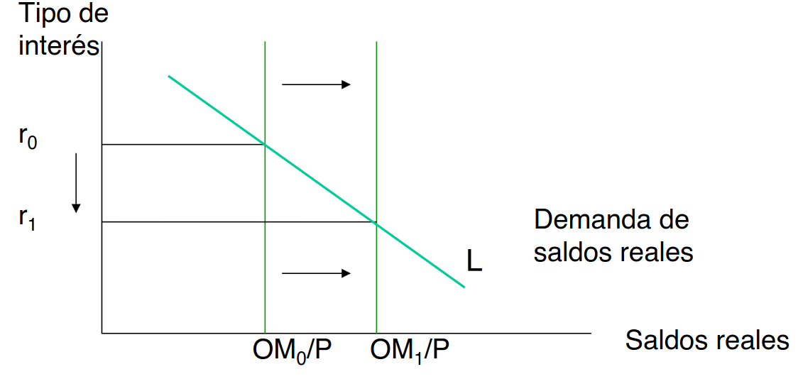

#### 3.4.1.1 Política monetaria restrictiva.

La política monetaria restrictiva es una política económica que consiste en reducir la cantidad de dinero en circulación, lo que se conoce como oferta monetaria, con el objetivo de reducir la inflación.

Esta tendra por objetivo **disminuir la oferta monetaria, lo que implicará una subida en los tipos de interés**.

Las herramientas que tiene el banco central a su disposición para conseguir esto son:

- Vende de títulos en el mercado abierto.
- Aumenta del coeficiente legal de caja.
- Reduce a los bancos nuevos créditos.

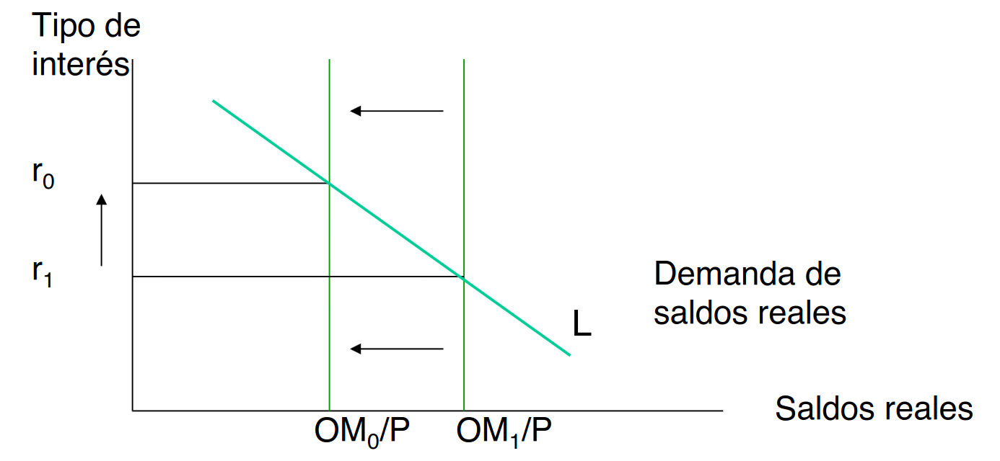

A modo de resumen:

| PM Expansiva | PM Restrictiva |
| --- | --- |
| Compra de títulos en el mercado abierto | Vende de títulos en el mercado abierto |
| Reducción del coeficiente legal de caja | Aumenta del coeficiente legal de caja |
| Conceder a los bancos nuevos créditos | Reduce a los bancos nuevos créditos |

### 3.4.2 La curva LM.

La **oferta monetaria en términos reales viene determinada por la cantidad nominal de dinero, M, controlada por el Banco Central, dividida por el nivel de precios**.

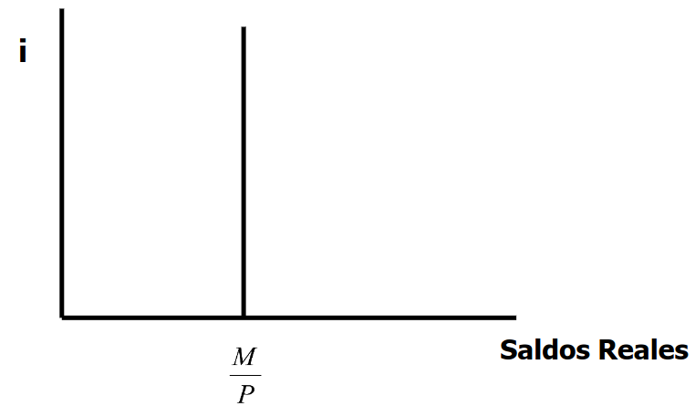

Si a esta curva le añadimos la curva de demanda de dinero, obtendremos el tipo de interés de equilibrio de mercado. A media que aumenta el nivel de renta, la demanda de dinero aumenta, lo que hace que el tipo de interés de equilibrio aumente. Si tratamos de representar **todos los puntos para los que el mercado esta esquilibrio para cada nivel de renta \\(Y\\), obtenemos la curva LM**:

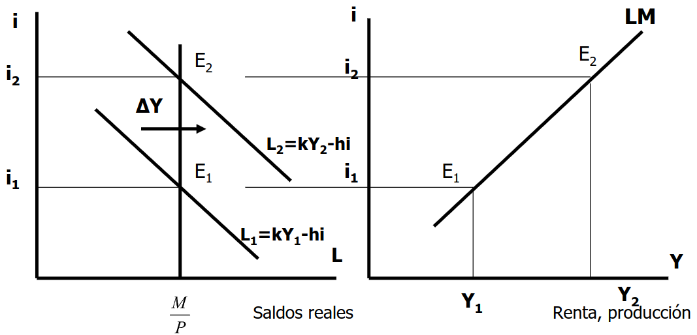

En otras palabras, la curva LM muestra todos los puntos para los que se cumple que

$$
\frac{M}{P}=kY-hi
$$

#### 3.4.2.1 ¿De qué depende la pendiente de la curva LM?

Partiendo de la ecuación mostrada hace un momento

$$
\frac{M}{P}=kY-hi
$$

Despejando el tipo de interés, tenemos la expresión de la curva LM

$$
i=\frac{1}{h} \left (Y-\frac{M}{P}\right )
$$

De la que se deduce que la pendiente será:

$$
\frac{k}{h}
$$

Por tanto, la curva LM será más inclinada:

- Cuanto mayor es la sensibilidad de la demanda de dinero a la renta, \\(k\\).

- Cuanto menor es la sensibilidad de la demanda de dinero al tipo de interés, \\(h\\).

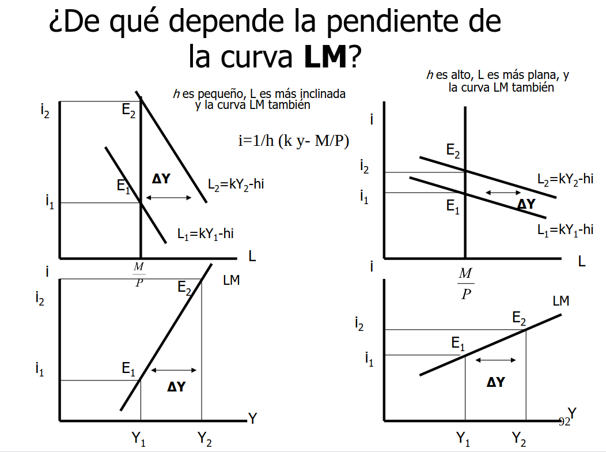{ width=55% }

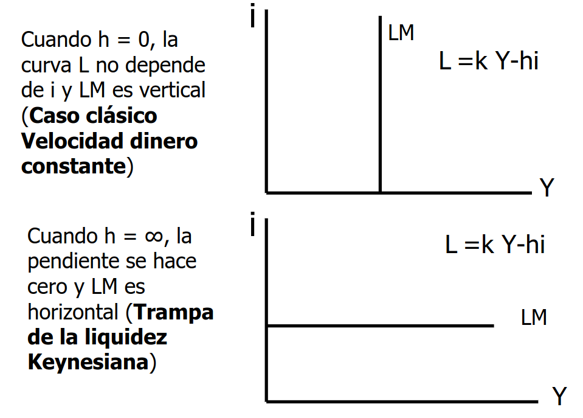{ width=55% }

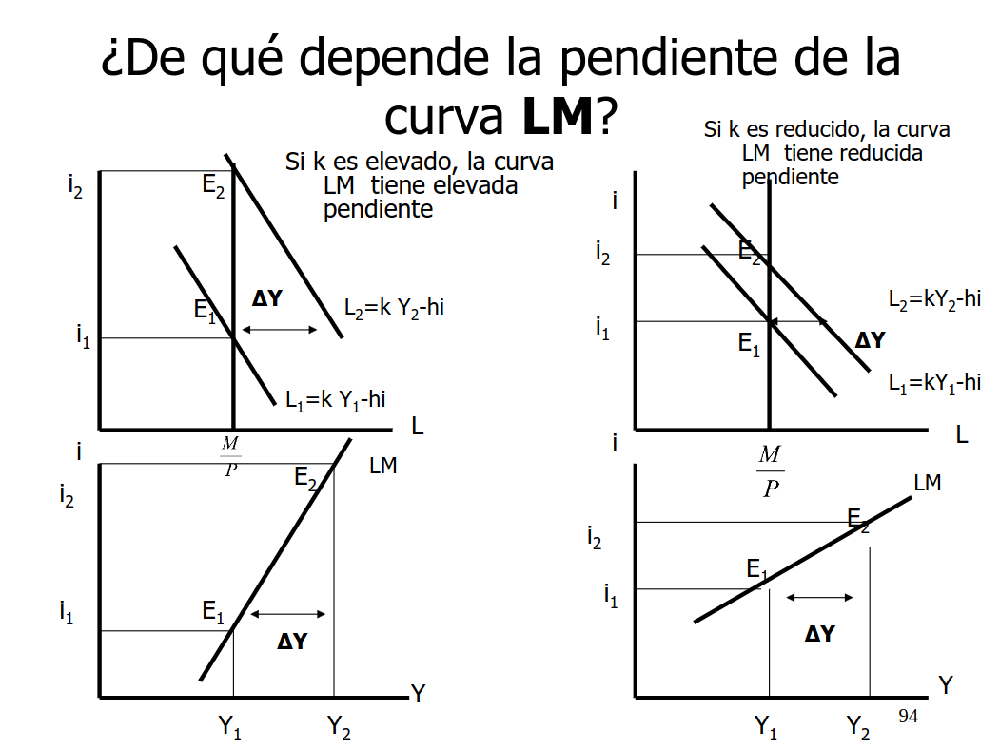{ width=55% }

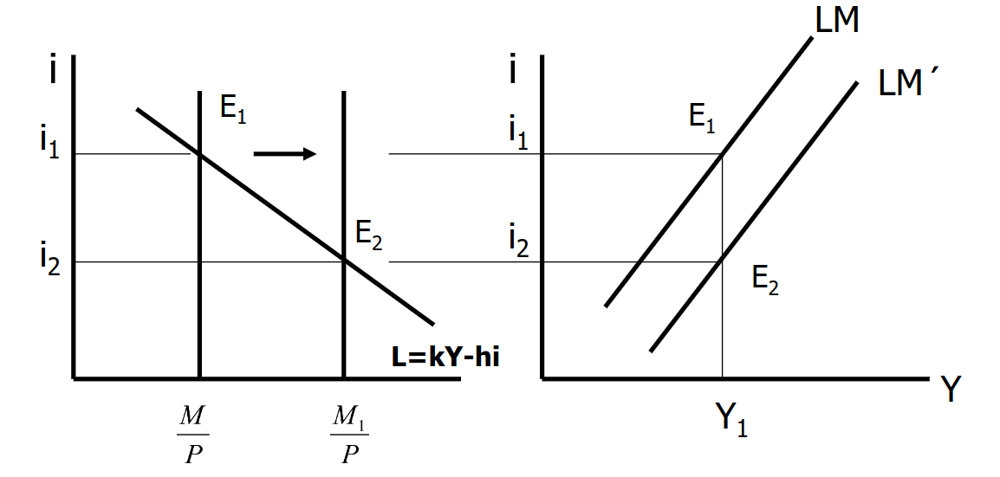{ width=55% }

#### 3.4.2.2 Posiciones fuera de la curva LM

- En el punto \\(E_4\\) hay un exceso de demanda de dinero (EDM)

- En el punto \\(E_3\\) hay un exceso de oferta de dinero (EOD)

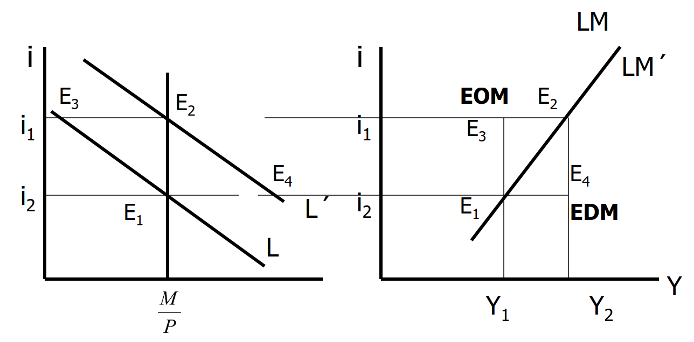
