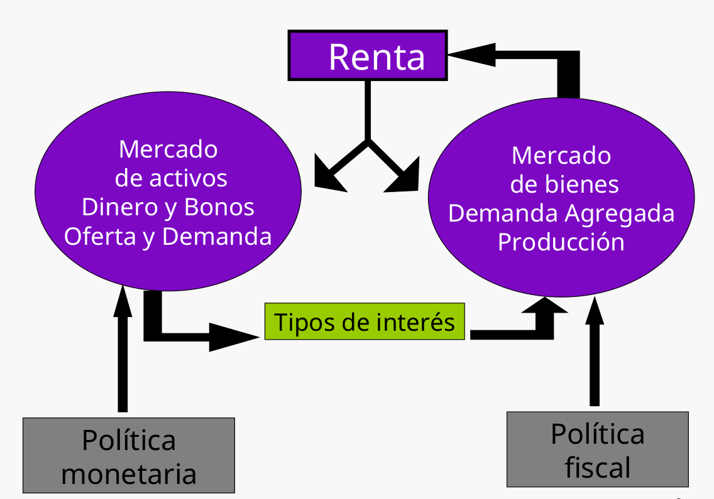
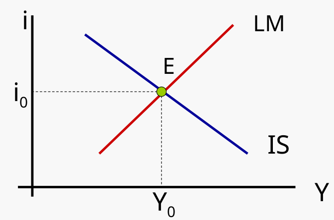
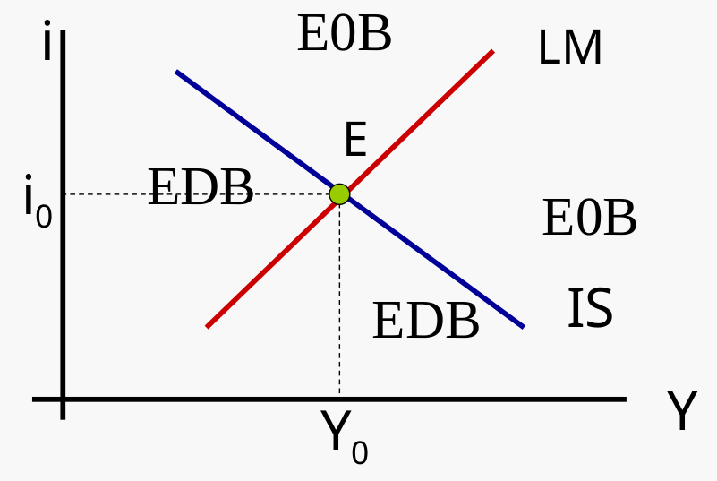
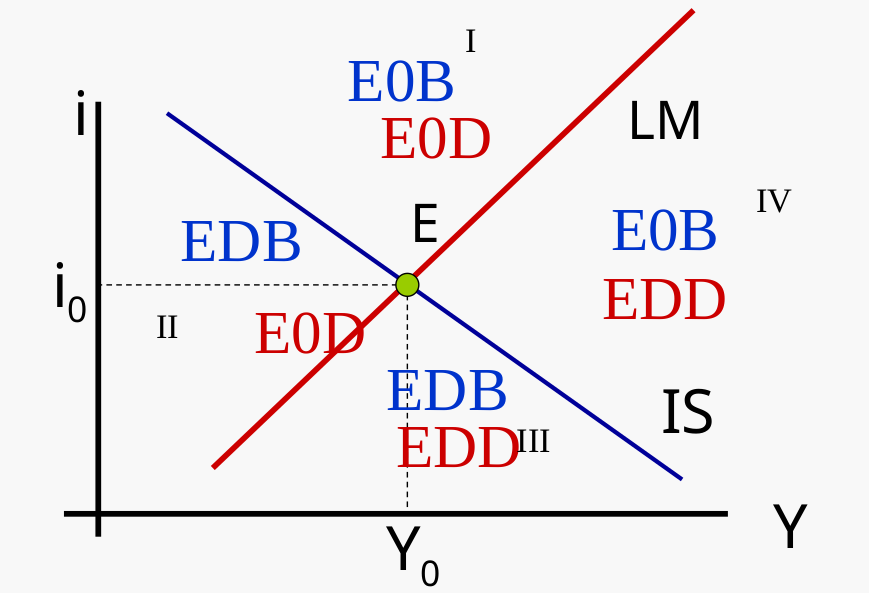
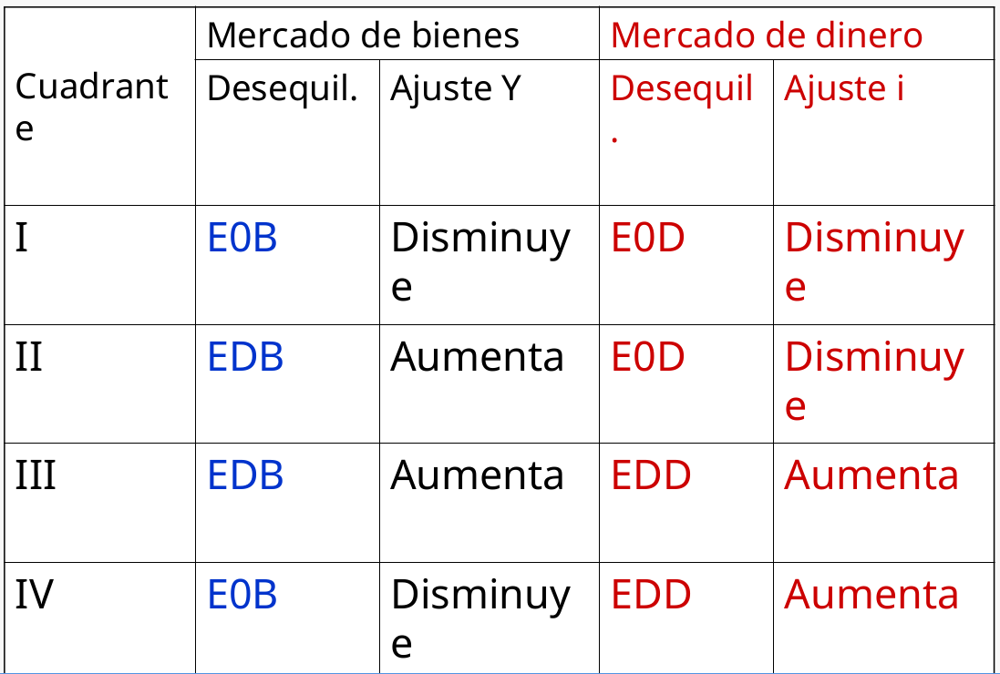
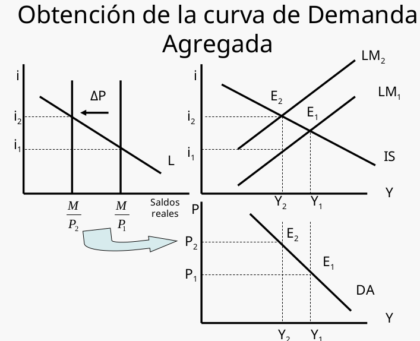
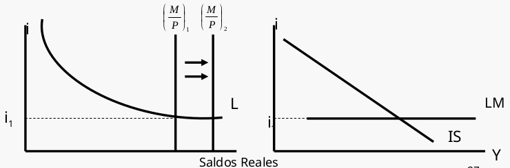
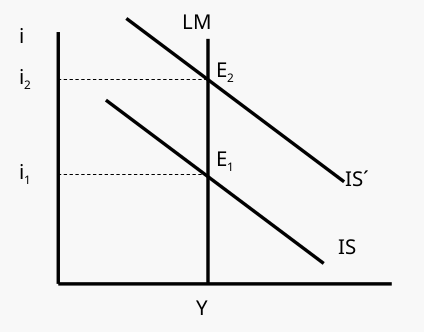
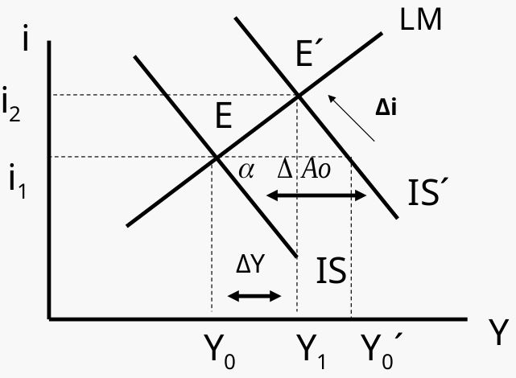
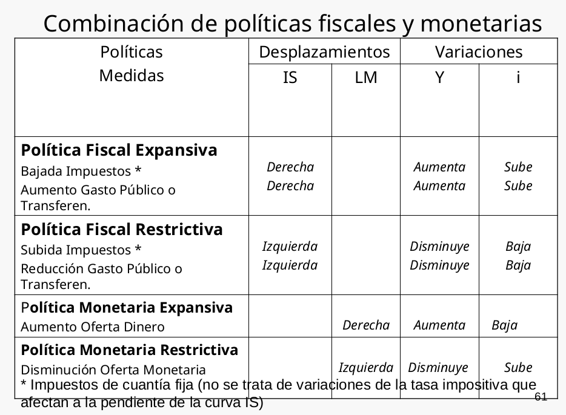

# Tema 4: El modelo IS-LM en una economía cerrada

## 4.1 El equilibrio en los mercados de bienes y financieros (modelo IS-LM)

Constituye el núcleo de la macroeconomía a corto plazo, y es el instrumento del análisis macroeconómico de la escuela de la síntesis keynesiano-clásico.

El modelo IS-LM determina los valores de la renta (PIB) y del tipo de interés (i) que equilibran o vacían simultáneamente los mercados de bienes y de dinero.

Aspectos importanes del modelo IS-LM:

- IS recoge la igualdad I=S (Investment=Saving).

- LM recoge la igualdad L=M/P (Liquidity preference=Money supply).

- Es una ampliación del modelo simple keynesiano, en el que se incluye el tipo de interés entre los determinantes de la demanda agregada.

- Los tipos de interés (i) y la renta (Y) son determinados conjuntamente por el equilibrio en los mercados de bienes y en los mercados de activos financieros.

{ width=55% }

El gasto, los tipos de interés y la renta se determinan conjuntamente por el equilibrio en los mercados de bienes y de activos.

Una política fiscal expansiva, por ejemplo, aumentaría en primer lugar el gasto y la renta. Sin embargo, este incremento de la renta afectaría a los mercados de activos aumentando la demanda de dinero y elevando por ello los tipos de interés. El aumento del tipo de interés reduce la demanda de inversión y, por tanto, la demanda agregada y la producción de equilibrio.

De hecho, en algunas circunstancias extremas, la subida de los tipos de interés puede ser suficiente para anular totalmente los efectos expansivos de la política fiscal.

Las variaciones del tipo de interés afectan a la composición de la demanda agregada entre gasto de inversión y de consumo.

La subida del tipo de interés reduce la demanda agregada principalmente al reducir la inversión. Una política fiscal expansiva tiende a elevar el consumo a través del multiplicador, pero tiende a reducir la inversión, ya que eleva el tipo de interés. Como la tasa de inversión afecta al crecimiento de la economía este efecto secundario es de suma importancia en la elaboración de la política económica.

Se debe recordar que en el modelo IS-LM:

- El nivel de precios es constante.
- 
- Las empresas están dispuestas a ofrecer cualquier cantidad de producto que se demande al nivel de precios vigente.
- 
- La producción se incrementa siempre que hay un exceso de demanda de bienes, y se contrae siempre que hay un exceso de oferta.
  
- El tipo de interés aumenta siempre que hay un exceso de demanda de dinero y disminuye siempre que hay un exceso de oferta.
  
Si pintamos las curvas IS y LM en un mismo gráfico, el equilibrio se produce en el punto de intersección de ambas curvas:

En el punto E el tipo de interés y el nivel de producción o renta son tales que los mercados de bienes y de dinero se vacían.

Dicho de otra manera en el punto E las empresas están produciendo la cantidad que planean (no existen existencias indeseadas) y el público tiene la composición de
cartera que desea (liquidez y bonos).

### 4.1.1 Desequilibrios.

{ width=50% }{ width=50% }

>El primero muestra un desequilibrio en el mercado de bienes, mientras que el segundo muestra desequilibrio en elmercado de dinero.

Si los unimos en un mismo gráfico:

{ width=50% }

Se puede comprobar que se converge hacia el equilibrio desde cualquier cuadrante.

En muchos casos es conveniente limitar la dinámica mediante el supuesto razonable de que el mercado monetario se ajusta muy deprisa y el de bienes se ajusta relativamente despacio. Puesto que el mercado de dinero se puede ajustar mediante la simple compra y venta de bonos, el tipo de interés se ajusta rápidamente, por lo que, en realidad, el mercado de dinero alcanza rápidamente el equilibrio. Este supuesto implica que siempre estamos sobre la curva LM.

>El mercado de bienes se ajusta de forma relativamente lenta porque las empresas tienen que variar sus programas de producción, y esto requiere tiempo.

## 4.2 Los multiplicadores de la política monetaria y fiscal.

Si partimos de la curva IS y LM:

$$
\text{Curva IS: } Y=\alpha (A_{0}-bi)
$$

$$
\text{Curva LM: } i=\frac{1}{h} \left (Y-\frac{M}{P}\right )
$$

Si sustituiimos \\(i\\) de LM en IS:

$$
Y=\alpha \left [A_{0}-\frac{b}{h} \left (kY-\frac{M}{P}\right )\right ]
$$

Hacemos un par de cambios:

$$
Y=\frac{\alpha}{1+k\alpha\frac{b}{h}}A_0+\frac{\alpha}{1+k\alpha\frac{b}{h}}\frac{b}{h}\frac{M}{P}
$$

$$
Y=\frac{\alpha h}{h+k\alpha b}A_0+\frac{\alpha b}{h+k\alpha b}\frac{M}{P}
$$

Donde llamaremos a \\(\frac{\alpha}{1+k\alpha\frac{b}{h}}\\) la constante \\(\gamma\\)

De forma que el expresaremos la renta o producción que equilibra los mercados de bienes y de dinero como:

$$
Y=\gamma A_0+\gamma\frac{b}{h}\frac{M}{P}
$$

Donde \\(\gamma\\) es el multiplicador de la política fiscal y \\(\gamma\frac{b}{h}\frac{M}{P}\\) es el multiplicador de la política monetaria.

### 4.2.1 Analizando la curva IS-LM.

La ecuación muestra que el nivel de renta de equilibrio depende de dos variables exógenas: el gasto autónomo \\(A_0\\), incluidos el consumo y la inversión autónomos (Co e Io) y los parámetros de la política fiscal (\\(G_0\\); \\(TR_0\\)); y la cantidad real de dinero (M/P).

La ecuación que expresa Y es **la curva de demanda agregada**. Resume la relación IS-LM, que relaciona Y y P, 21 dados los niveles de Ao y M.

#### 4.2.1. Tipo de interés de equilibrio.

El tipo de interés de equilibrio, \\(i_0\\) , se halla introduciendo el nivel de renta de equilibrio, Yo, en la ecuación de la curva LM.

$$
i=\frac{1}{h} \left (Y-\frac{M}{P}\right ) \Rightarrow i=\frac{1}{h} \left (k \left (\frac{\alpha h}{h+k\alpha b}A_0+\frac{\alpha b}{h+k\alpha b}\frac{M}{P} \right )-\frac{M}{P}\right )
$$

Simplificando:

$$
i=\frac{k}{h}\gamma A_0-\left (\frac{1}{h+k\alpha b} \right )\frac{M}{P}
$$

Esta ecuación muestra que el tipo de interés de equilibrio depende de los parámetros de la política fiscal, contenidos en el multiplicador y en el término \\(A_0\\), y de la cantidad de dinero en términos reales.

>Una mayor cantidad real de dinero implica un tipo de interés de equilibrio más bajo.

#### 4.2.2. El multiplicador de la política fiscal.

El multiplicador de la política fiscal muestra cuanto varía el nivel de renta de equilibrio cuando se incrementa el gasto público, manteniendo constante la oferta monetaria real (\\(\frac{M}{P}\\)).

Para \\(\Delta A_0 = \Delta G\\) actua el multiplicador de la política fiscal \\(\gamma = \frac{\alpha h}{h+k\alpha b}\\)

Existe un efecto amortiguador de la subida de tipo de interés que acompaña a una expansión fiscal en el modelo IS-LM.

#### 4.2.3. El multiplicador de la política monetaria.

El multiplicador de la política monetaria muestra cuanto aumenta el nivel de renta de equilibrio cuando aumenta la oferta monetaria real, manteniéndose constante la política fiscal (\\(A_0\\)).

Para \\(\Delta \frac{M}{P}\\) actua el multiplicador de la política monetaria \\(\gamma\frac{b}{h} = \frac{\alpha b}{h+k\alpha b}\\)

Cuando más altos son \\(b\\) y \\(\alpha\\) , más expansiva es la influencia de un aumento de los saldos reales en el nivel de renta de equilibrio. Si los valores de \\(b\\) y \\(\alpha\\) de son altos, la curva IS es muy plana.

Cuanto más bajos son los valores de h y k más elevado es el multiplicador monetario.

Ante un incremento de los saldos reales:
- Si b es muy alto la reducción del tipo de interés incrementa considerablemente la demanda de inversión.
- Al ser h bajo la demanda de dinero se incrementará muy poco, por lo que la mayor liquidez se destinará, en gran medida, al aumento de la inversión.
- Con k reducido el incremento de la renta apenas elevará la demanda de dinero, dejando gran parte de la liquidez al aumento de la inversión.

### 4.2.4 Lla curva de demanada agregada.

{ width=50% }

## 4.3 La política monetaria.

El banco central dirige la política monetaria en cada país. A través de actuaciones como **las operaciones de mercado abierto**, éste puede aumentar o disminuir la cantidad de dinero en circulación.

{ width=50% }

### 4.3.1. La política monetaria y el mecanismo de transmisión.

El mecanismo de transmisión es el proceso por el que los cambios de la política monetaria afectan a la DA. Consta de los siguientes pasos:

1. Variación de la oferta monetaria.
2. Alteración del tipo de interés, provoca desequilibrios en las carteras.
3. La variación de los tipos de interés afectan al gasto, sobre todo al gasto de inversión.
4. La producción se ajusta a la variación de la DA.

>Si los desequilibrios de las carteras originados por un incremento de la oferta monetaria no altera significativamente el tipo de interés, cualquiera que sea la razón, o si la demanda
agregada no responde a las variaciones de los tipos de interés, no existirá relación entre el dinero y la producción.

#### 4.3.1.1 La trampa de la liquidez.

Trampa de la liquidez o preferencia por la liquidez (teoría de Keynes), situación en la que el público está dispuesto a mantener cualquier cantidad de dinero que se ofrezca a un tipo de interés dado.

La Trampa de la liquidez hace referencia a la posibilidad de que aumentos en la cantidad de dinero no reduzcan el tipo de interés.

La curva LM es horizontal y por tanto las variaciones de la cantidad de dinero no la desplazan. La política monetaria no puede influir en el nivel de renta y la política fiscal es muy efectiva.

{ width=50% }

Recordemos el multilicador de la política monetaria:

#### 4.3.1.2 El multiplicador de la política monetaria.
$$
\gamma\frac{b}{h} = \frac{\alpha b}{h+k\alpha b}
$$

Si la demanda de dinero es poco sensible al tipo de interés (h
reducido), la curva LM será mas inclinada como vimos en el tema anterior, por lo que  una determinada variación de la oferta monetaria provocará una gran variación del tipo de interés e influirá significativamente en la demanda de inversión y, por tanto, en el nivel de renta.

Asímismo, si la demanda de dinero no es muy sensible a la renta
(k reducido), se necesitará una elevación importante de la misma
para absorber un determinado aumento de la cantidad de
dinero.

#### 4.3.1.3 El caso clásico.

La demanda de dinero es totalmente insensible al tipo de interés (h = 0). La curva LM es vertical.

Implica que la política monetaria produce un efecto máximo en el
nivel de renta, sin embargo la política fiscal no tiene influencia.

Por lo que en este caso, si tenemos que la curva LM es 
$$
\frac{M}{P}=(kY-hi) \Rightarrow \frac{M}{P}=kY
$$

> En el caso clásico, la política monetaria es muy efectiva y la política fiscal no tiene influencia.

## 4.4 La política fiscal.

La política fiscal es la realizada por el Gobierno a través de sus actuaciones
sobre los tipos impositivos e impuestos, las transferencias y el gasto público.

Existe efecto expulsión cuando una política fiscal expansiva provoca una subida de
los tipos de interés y reduce así el gasto privado, especialmente la inversión.

### 4.4.1. El efecto expulsión.

Si se produce una política fiscal expansiva, por ej. Un aumento del Gasto Público.

{ width=50% }

El aumento del gasto público eleva la renta de equilibrio, pero también eleva la demanda de dinero y, por tanto, **el tipo de interés**. El aumento del tipo de interés reduce la demanda de inversión y, por tanto, la demanda agregada y la producción de equilibrio.

En definitiva, el aumento del gasto público conduce a una disminución de la inversión privada, lo que reduce el efecto expansivo de la política fiscal.

¿De qué depende la magnitud efecto expulsión?

-  más plana sea la curva LM, mayor es el
crecimiento de la renta y menor la subida del tipo de
interés (menor efecto-expulsión). Si LM es vertical (caso
clásico) el efecto-expulsión es máximo.

- Cuanto más plana es la curva IS, los tipos de interés suben
menos.

- La renta y los tipos de interés aumentan más cuanto
mayor sea el multiplicador,\\(\alpha\\), y por lo tanto, cuanto
mayor sea el desplazamiento horizontal de la curva IS.

### 4.4.2. El multiplicador de la política fiscal.

Recordemos que es:
$$
\gamma = \frac{\alpha h}{h+k\alpha b}
$$

Cuando el valor de k y de b es alto, disminuye la influencia del gasto público en la renta.

Si la demanda de dinero experimenta un gran incremento (k) a medida que se eleva la renta es necesaria una elevada subida de los tipos de interés para mantener el mercado de dinero en equilibrio, lo cual, cuando el valor de b es alto, implica una gran reducción de la inversión privada.

El multiplicador de la política fiscal es casi igual a cero si h es muy pequeño (caso clásico), y será igual \\(\alpha\\) a si h tiende a infinito.

Si h es muy elevado al elevarse ligeramente el tipo de interés (por el incremento de la producción y la renta) la demanda de dinero disminuiría rápidamente, dejando libre la liquidez para la inversión.

## 4.5 Combinación de políticas monetaria y fiscal.
{ width=50% }

